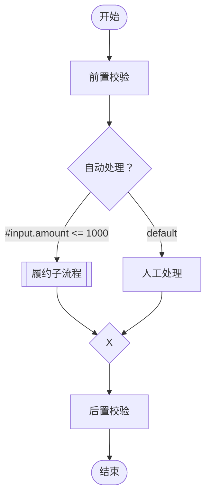

# flow-engine

一个嵌入 Spring 应用、以 Markdown 中 Mermaid 流程图为定义的轻量级 Java 流程执行框架。

## 当前能力

- 串行与显式并行分叉/汇合
- 菱形条件网关，出边使用受限 SpEL 表达式
- Spring `FlowNode` Bean 自动绑定
- 使用 `_alias` 在同一流程中多次调用同一个 Bean
- 使用 Mermaid 双边框节点同步调用子流程
- 流程、节点超时，并发与队列容量限制
- 每次执行独立的节点状态、结果和错误记录
- 注册阶段校验非法语法、缺失 Bean、环和子流程循环引用

项目定位是进程内执行框架，不提供数据库、管理平台、分布式调度或人工审批能力。

## 环境

- JDK 17+
- Maven 3.9+
- Spring Framework 7（Spring 适配模块）

## 快速开始

业务节点实现 `FlowNode` 并注册为 Spring Bean：

```java
@Bean
FlowNode validateOrder() {
    return context -> Map.of("valid", true);
}

@Bean(destroyMethod = "close")
FlowEngine flowEngine(ConfigurableListableBeanFactory beans) {
    return new DefaultFlowEngine(
        new SpringNodeResolver(beans),
        new SpelConditionEvaluator()
    );
}
```

使用 Mermaid 编排：

````markdown

````

约定：

- 矩形节点 ID 默认就是 Spring Bean ID。
- `validateOrder_before` 和 `validateOrder_after` 都调用 `validateOrder` Bean，完整 ID 用于隔离两次调用的状态和结果。
- 普通菱形是一入多出的条件网关，恰好选择一条出边；`default` 最多一条。
- `{"+"}` 是并行分叉或并行汇合，汇合等待全部已激活输入。
- 双边框节点按 ID 查找子流程；例如 `fulfillment_main` 调用 `fulfillment` 流程。

注册并执行：

```java
engine.registerAll(Map.of(
    "orderFlow", orderMarkdown,
    "fulfillment", fulfillmentMarkdown
));

FlowResult result = engine.execute(
    "orderFlow",
    Map.of("amount", 800)
);
```

完整可运行代码见 `flow-engine-examples`。

## 模块

- `flow-engine-core`：Mermaid 子集编译、图校验、DAG 调度与公共 API。
- `flow-engine-spring`：Spring Bean 解析和安全受限的 SpEL 求值。
- `flow-engine-examples`：串行、条件、并行、别名及子流程组合示例。

主要包结构：

- `io.github.mchgood.flow`：公共 API、配置和执行结果模型。
- `io.github.mchgood.flow.engine`：编译器、图模型和运行时实现。
- `io.github.mchgood.flow.spring`：Spring Bean 与 SpEL 适配。

## 验证

```bash
mvn verify
```

## 文档

- [快速使用](docs/quick-start.md)
- [需求文档](docs/requirements.md)
- [技术方案](docs/technical-design.md)

当前版本为原型阶段的 `0.1.0-SNAPSHOT`，API 尚未承诺兼容性。
