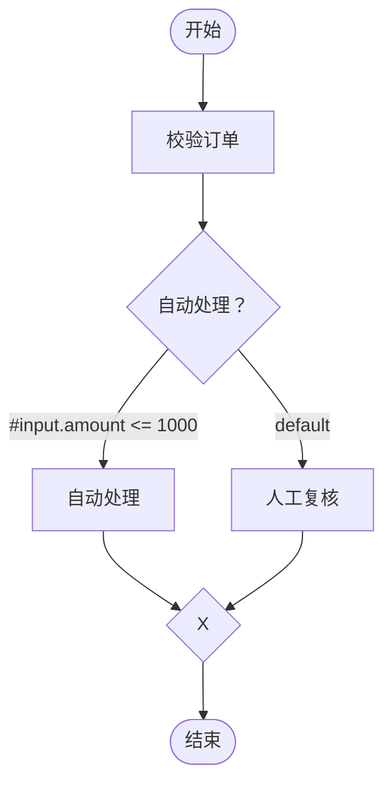
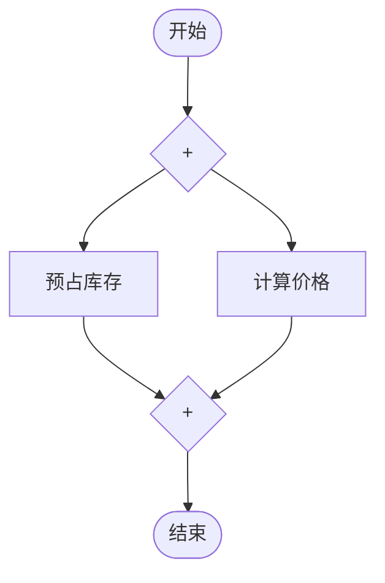
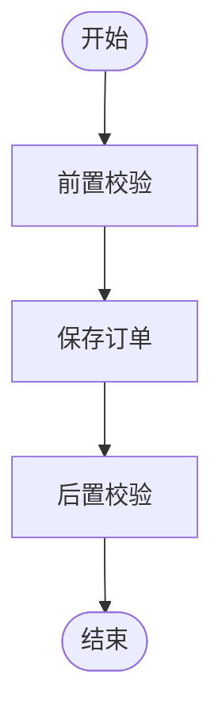
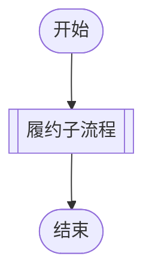

# Flow Engine 快速使用

本文用一个最小 Spring 示例演示如何定义节点、编写 Mermaid 流程、注册并执行流程。

## 1. 环境要求

- JDK 17+
- Maven 3.9+
- Spring Framework 7

当前项目仍处于 `0.1.0-SNAPSHOT` 原型阶段，尚未发布到 Maven Central。请先在源码根目录安装：

```bash
mvn install
```

## 2. 添加依赖

Spring 应用通常只需要引入 Spring 适配模块，它会传递依赖核心模块：

```xml
<dependency>
    <groupId>io.github.mchgood</groupId>
    <artifactId>flow-engine-spring</artifactId>
    <version>0.1.0-SNAPSHOT</version>
</dependency>
```

## 3. 定义业务节点

每个矩形任务节点对应一个实现 `FlowNode` 的 singleton Spring Bean。Bean 名称就是流程图中的节点 ID。

```java
import io.github.mchgood.flow.*;
import io.github.mchgood.flow.engine.DefaultFlowEngine;
import io.github.mchgood.flow.spring.SpelConditionEvaluator;
import io.github.mchgood.flow.spring.SpringNodeResolver;

@Configuration
public class FlowConfiguration {

    @Bean
    public FlowNode validateOrder() {
        return context -> {
            Map<?, ?> input = context.input(Map.class);
            return Map.of("valid", input.containsKey("amount"));
        };
    }

    @Bean
    public FlowNode autoProcess() {
        return context -> Map.of("processed", true);
    }

    @Bean
    public FlowNode manualReview() {
        return context -> Map.of("reviewRequired", true);
    }

    @Bean(destroyMethod = "close")
    public FlowEngine flowEngine(ConfigurableListableBeanFactory beans) {
        return new DefaultFlowEngine(
            new SpringNodeResolver(beans),
            new SpelConditionEvaluator()
        );
    }
}
```

`FlowNode.execute` 可以返回任意业务结果，也可以返回 `null`。异常会被引擎记录为节点失败，并阻止依赖该节点的后续节点执行。

## 4. 编写流程

新建 `order-flow.md`：

````markdown
# 订单流程


````

条件网关会计算所有非默认出边的 SpEL：

- 恰好一个条件为 `true`：执行对应分支。
- 多个条件为 `true`：以 `CONDITION_CONFLICT` 失败。
- 全部为 `false`：执行 `default` 分支。
- 全部为 `false` 且没有默认边：以 `NO_MATCHING_BRANCH` 失败。

## 5. 注册并执行

```java
String markdown = Files.readString(Path.of("order-flow.md"));

FlowDescriptor descriptor = engine.register("orderFlow", markdown);

FlowResult result = engine.execute(
    "orderFlow",
    Map.of("amount", 800)
);

if (!result.succeeded()) {
    result.errors().forEach(System.err::println);
}

result.results().forEach((nodeId, node) ->
    System.out.println(nodeId + " -> " + node.status())
);
```

同一个 flowId 不能重复注册。建议应用启动时一次性使用 `registerAll` 原子注册存在引用关系的一组流程。

## 6. 并行执行

使用标签为 `+` 的菱形明确表示并行分叉和汇合：



`reserveStock` 与 `calculatePrice` 会在容量允许时并行执行；`join` 等待两个已激活分支都完成。

## 7. 重复调用同一个 Bean

默认情况下节点 ID 就是 Bean ID。需要在同一流程中多次调用同一个 Bean 时，使用 `_alias`：



`validateOrder_before` 与 `validateOrder_after` 都调用 `validateOrder` Bean。执行状态和结果仍按完整节点 ID 分别保存。

## 8. 调用子流程

双边框矩形表示子流程调用：



`fulfillment_main` 调用 flowId 为 `fulfillment` 的流程，`main` 是本次调用的别名。

父子流程规则：

- 子流程继承父流程输入。
- 子流程拥有独立上下文，不能直接读取父流程节点结果。
- 子流程成功后父流程才继续。
- 子流程失败或超时会传递给调用节点。
- 流程引用不能形成循环。

存在子流程引用时，应一起注册：

```java
engine.registerAll(Map.of(
    "orderFlow", orderFlowMarkdown,
    "fulfillment", fulfillmentMarkdown
));
```

## 9. 读取祖先结果

节点只能读取当前节点的祖先结果，不能读取兄弟分支或父流程内部结果：

```java
@Bean
public FlowNode saveOrder() {
    return context -> {
        Map<?, ?> validation = context.ancestorValue(
            "validateOrder_before",
            Map.class
        );
        return Map.of("saved", validation.get("valid"));
    };
}
```

条件边中使用：

```text
#results['validateOrder'].present
#results['validateOrder'].value.valid == true
```

SpEL 上下文只提供 `#input` 和 `#results`，且禁止 Bean 访问、类型访问、构造器、方法调用和赋值。

## 10. 设置执行超时

单次执行可以覆盖默认流程超时：

```java
FlowResult result = engine.execute(
    "orderFlow",
    input,
    ExecutionOptions.withTimeout(Duration.ofSeconds(10))
);
```

线程数、队列容量、并发执行数、单节点超时和子流程限制通过 `EngineConfig` 设置。业务节点收到中断后应尽快退出；对于忽略中断的代码，引擎会固定超时终态，但无法强制终止 Java 线程。

## 11. 图形语法速查

| Mermaid 写法 | 含义 | 是否调用 Bean |
|---|---|---|
| `start([开始])` | 开始节点 | 否 |
| `finish([结束])` | 结束节点 | 否 |
| `task["任务"]` | 业务任务，调用 `task` Bean | 是 |
| `task_alias["任务"]` | 业务任务，调用 `task` Bean | 是 |
| `decision{"条件"}` | 排他分支网关 | 否 |
| `merge{"X"}` | 排他汇合网关 | 否 |
| `gateway{"+"}` | 并行分叉或汇合 | 否 |
| `child[["子流程"]]` | 调用 `child` 流程 | 否 |
| `child_alias[["子流程"]]` | 调用 `child` 流程 | 否 |

当前只支持 `flowchart TD` 和 `flowchart LR`，不支持循环、条件写在节点中或任意 Mermaid 语法。注册失败时应按返回的错误码和源码位置修正定义，不要忽略错误继续运行。

## 12. 运行项目示例

```bash
mvn -pl flow-engine-examples -am test
```

完整示例位于：

- `flow-engine-examples/src/main/java/io/github/mchgood/flow/OrderExample.java`
- `flow-engine-examples/src/test/java/io/github/mchgood/flow/OrderExampleTest.java`
