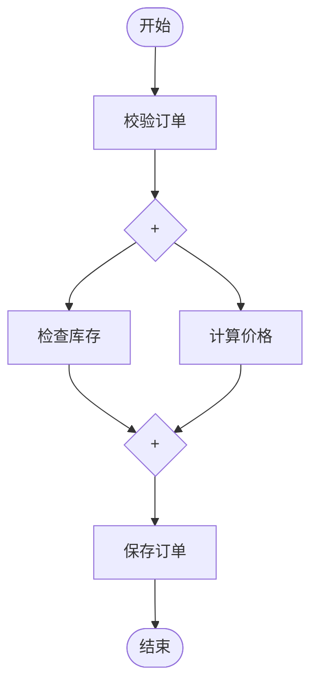
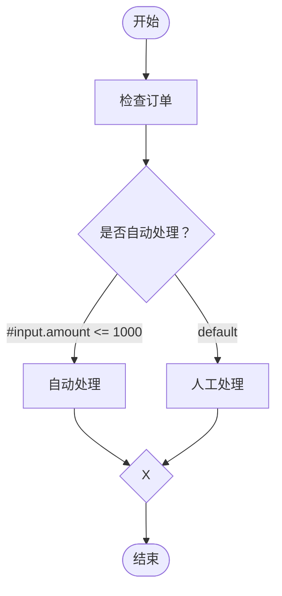
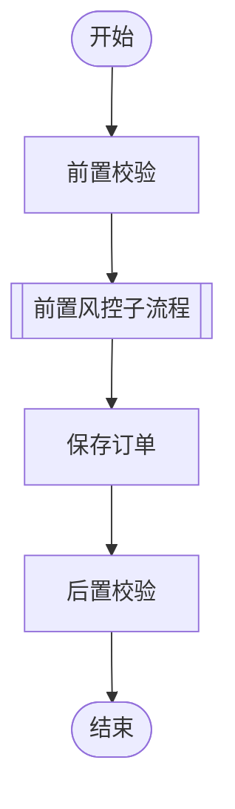

# Flow Engine 需求文档

版本：v0.4（评审草案，调用别名与子流程）  
日期：2026-09-05  
本期目标：通过 Markdown 中的 Mermaid 流程图，编排 Spring Bean，支持串行、并行、排他条件分支和显式子流程调用。

## Spring Boot 接入补充

交付 `flow-engine-spring-boot-starter`，引入后自动装配 FlowEngine、节点解析器、条件求值器和 EngineConfig。通过 `flow-engine.*` 配置资源与期限，默认值与 core 一致；非法配置启动失败。允许按类型覆盖默认 Bean，支持关闭自动装配；容器关闭时关闭自动创建的引擎。流程加载、注册和执行时机仍由宿主决定。当前验证基线为 Boot 4.1.1 / Spring 7.0.9，普通 Spring 接入保留。

## 1. 背景与目标

希望建立一个面向 Java/Spring 开发者的轻量级流程引擎，让业务逻辑保留在 Spring Bean 中，流程关系通过 Markdown 流程图维护。开发者修改连线即可调整执行顺序与并行关系，并能在支持 Mermaid 的 Markdown 阅读器中查看流程。

### 1.1 已确认需求

- 流程定义由 Markdown 中的流程图承载，不使用 YAML 等另一套结构来定义拓扑。
- 业务节点对应 Spring Bean；默认以小驼峰 beanId 命名，单下划线后为调用别名。
- 双边框矩形调用已注册流程，支持嵌套，不支持循环引用。
- 条件分支为首期必需能力，由出边 SpEL 表达式结果决定目标节点，条件网关不绑定决策 Bean。
- 支持灵活编排；在原串行、并行范围上补充具有执行语义的图形和条件网关。
- 追求轻量化，当前阶段先评审需求，不编写引擎代码。

### 1.2 本文提出、尚待确认的设计

- 使用 Mermaid flowchart 的明确子集表达有向无环图（DAG）。
- 引擎嵌入现有 Spring 应用，在单个进程内执行。
- 节点 Bean 实现统一接口；普通业务 Service 可由节点 Bean 包装调用。
- 普通任务及并行汇合等待全部输入成功；排他汇合只接续被选中的路径。
- 采用独立节点结果，不允许节点随意修改共享上下文。
- 默认失败后停止调度新节点；已开始的节点有界收尾。

后续章节中的“应”“必须”均表示本草案建议采用的验收要求，并不代表这些细节已获确认。

## 2. 框架定位与职责

Flow Engine 是供 Java/Spring 应用直接依赖和调用的流程执行框架。交付物是框架代码、接入接口、使用说明和示例。宿主应用持有业务节点并发起流程执行。

框架负责把 Markdown 中的 Mermaid 图转化为可执行依赖关系，并在当前进程内完成节点调度。可视化由支持 Mermaid 的 Markdown 阅读器提供。

### 2.1 核心职责

| 能力 | 框架职责 |
| --- | --- |
| 流程解析 | 提取 Mermaid，解析节点和依赖边 |
| 定义校验 | 校验受支持语法、图结构及节点绑定 |
| 节点接入 | 查找并绑定宿主应用中的 Spring Bean |
| 流程执行 | 支持串行、并行、条件分支、汇合及子流程调用 |
| 数据传递 | 提供执行上下文和节点结果，隔离单次运行状态 |
| 运行控制 | 限制并发，处理节点失败与超时 |
| 结果反馈 | 返回执行结果和错误，提供必要诊断信息 |

### 2.2 宿主应用职责

- 提供流程定义并决定何时加载、何时调用。
- 实现业务 Bean，管理业务数据和外部服务调用。
- 提供运行资源及配置，按业务需要消费执行结果。

首期实现串行、并行、排他条件分支和子流程调用；边条件使用受限只读 SpEL。循环及包含网关（一次选择多条条件路径）不纳入当前实现。条件由引擎求值，业务操作留在矩形任务 Bean 中。

## 3. 核心使用场景

### 3.1 串行执行

开发者将三个 Bean 连成依赖链，后一个节点只在前一个成功后运行。调整连线即可改变执行顺序，无需修改节点业务代码。

### 3.2 并行后汇合

订单校验成功后，同时检查库存与计算价格，两项均成功后保存订单。

业务 Bean：validateOrder、checkStock、calculatePrice、saveOrder。fork 和 join 是并行网关，分别负责分叉和等待；与 start/finish 一样由引擎执行，无需业务 Bean。

### 3.3 按依赖就绪调度

支持分支长度不同、多处汇合以及并行分支内的串行步骤。节点只等待自己的前驱，不等待图中无依赖关系的其他节点。

例如 loadData 后有两个分支：slowCheck，以及 fastCheck → enrich。fastCheck 完成后，enrich 即可执行，不必等待 slowCheck；只有两条分支共同指向的汇合节点需要等待两方。

### 3.4 条件分支后汇合

引擎在 decision 处计算出边条件：金额不超过 1000 时走 autoProcess，否则走默认边 manualProcess。只有选中路径执行；另一条正常跳过，merge 接续选中路径。decision 和 merge 均不需要业务 Bean。

## 4. 流程文件规范

### FR-01 文件与流程身份

- 一个 `.md` 文件定义一个流程，仅允许一个 `mermaid` 围栏代码块，且该代码块必须为受支持的 flowchart。
- Markdown 标题、普通段落和其他语言代码块仅作说明，不参与执行。
- flowId 使用小驼峰 `[a-z][A-Za-z0-9]*`，不得含 `_`，同一注册范围内唯一。内容加载入口显式指定；文件适配可从符合此规则的文件名推导，否则要求显式指定。
- 框架接受宿主应用提供的 Markdown 内容进行加载；文件读取及启动接入可提供便捷适配，不要求宿主必须在启动时加载。
- 为加载的定义记录内容摘要作为 definitionHash，仅用于关联本次执行所使用的定义。
- 每次执行固定引用一个已加载定义快照及其已解析子流程定义。

### FR-02 图形与 Mermaid 语法

图形是执行定义的一部分，不再仅用于展示。先由形状及保留标记确定节点类别，再根据入边/出边数量区分分叉或汇合。下列是本框架采用的图形约定，不宣称完整实现 BPMN。

| 图形 | Mermaid 示例 | 执行语义 | 业务 Bean |
| --- | --- | --- | --- |
| 起止形 | `start([开始])`、`finish([结束])` | 流程入口与出口，ID 保留 | 不需要 |
| 矩形 | `checkStock["检查库存"]` | 执行业务任务 | FlowNode |
| 双边框矩形 | `riskCheck[["风控子流程"]]` | 调用 flowId=riskCheck 的流程 | 不需要 |
| 普通或带 X 的菱形 | `decision{"是否通过？"}` | 一入多出：排他选择，只选择一条边 | 不需要；引擎求值出边 SpEL |
| 普通或带 X 的菱形 | `merge{"X"}` | 多入一出：排他汇合，接续选中路径 | 不需要 |
| 带 + 的菱形 | `fork{"+"}`、`join{"+"}` | 一入多出：并行分叉；多入一出：并行汇合 | 不需要 |

菱形作为网关、使用 + 区分并行，与常见流程建模符号一致；本框架的排他汇合还受“节点每次运行最多一次”和结构化分支限制，不能直接套用完整 BPMN 的 token 行为。[BPMN 网关符号参考](https://camunda.com/en/bpmn/reference/)

- `flowchart TD` / `LR` 均支持，布局方向不影响执行。
- 普通 `A --> B`、链式边 `A --> B --> C` 支持。
- 排他分叉出边使用 `A -->|"SpEL表达式"| B`；默认边使用 `A -->|"default"| B`。其他节点出边禁止条件或默认标记。
- `default` 为精确匹配的框架保留标记，不参与 SpEL 求值；每个条件网关最多一条默认边。
- 边标签为表达式本身，不使用 `#{...}` 模板包裹，不再使用 yes/no 等路由键。
- 所有非默认出边都必须带表达式；空标签、多个默认边在加载时拒绝。
- 网关必须有显式菱形声明；业务节点仅引用 ID 时仍默认为矩形任务。
- 菱形文案精确为 `+` 时是并行网关；其他菱形文案表示排他网关。普通文案可修改，保留标记 `+` 不能当作装饰随意改动。
- 网关只支持一入多出或多入一出，至少两条分支；多入多出必须拆成两个网关，一入一出的菱形报错。
- 保留旧图中矩形多出边/多入边的隐式并行语义，但新图建议显式画并行网关。条件选择必须使用菱形，不能仅给矩形出边加标签。
- `%%` 普通注释仅作说明；取消注释绑定机制。旧 `@bean` 绑定声明应报废弃语法错误，避免误按默认名称执行。
- 子图、循环、其他箭头、样式/类/点击/初始化指令、其他形状均明确拒绝；SpEL 仅在排他分叉出边中使用。

Mermaid 负责显示形状和连线；本框架解释其执行含义。改变矩形为菱形会改变执行语义，不能作为纯样式编辑。[Mermaid flowchart 语法](https://mermaid.ai/open-source/syntax/flowchart.html)

### FR-03 节点 ID、目标 ID 与调用别名

先按形状确定调用类型，再解析完整节点 ID。不额外维护映射表或绑定注释。

| 完整节点 ID | 形状 | 目标 | 调用别名 |
| --- | --- | --- | --- |
| validateOrder | 矩形 | beanId=validateOrder | 无 |
| validateOrder_before | 矩形 | beanId=validateOrder | before |
| validateOrder_after | 矩形 | beanId=validateOrder | after |
| riskCheck | 双边框矩形 | flowId=riskCheck | 无 |
| riskCheck_before | 双边框矩形 | flowId=riskCheck | before |

- TASK 和子流程调用节点均以第一个 `_` 分隔：前半段为目标 ID，剩余全部为别名。
- 目标 ID 使用小驼峰、不含下划线，语法为 `[a-z][A-Za-z0-9]*`；别名为 `[A-Za-z0-9]+(?:_[A-Za-z0-9]+)*`，不能为空。`checkOrder_before_save` 的目标是 checkOrder，别名为 before_save。
- 不含 `_` 时完整节点 ID 就是目标 ID。`_before`、`checkOrder_`、`checkOrder__before` 等非法命名在加载时报错。
- 完整节点 ID 在一个流程内唯一，用于连线、状态、日志和结果键；重复引用同一完整 ID 表示同一节点，不表示多次执行。
- 不同流程的内部节点 ID 可以重复，由 executionId 区分。不同调用别名产生独立调用状态，但同一 singleton Bean 仍是共享实例。
- TASK 查 Spring Bean，子流程节点查流程注册表；形状决定命名空间，不做自动猜测或回退查找。
- start、finish 和网关不参与 Bean/flowId 别名解析；它们由引擎执行。

图中 validateOrder 调用两次，riskCheck 子流程调用一次；结果分别保存在完整节点 ID 下。

### FR-04 图结构校验

必须存在且仅存在一个 start 和一个 finish，至少一个业务节点。start 不得有入边，finish 不得有出边。每个业务节点必须从 start 可达，并能到达 finish。

加载时拒绝：环、自环、孤立节点、重复边、未知语法、缺少代码块、多个 Mermaid 代码块、Bean 缺失、Bean 不满足对应节点接口、流程 ID 冲突、非法调用别名、子流程缺失或循环引用，以及网关形状冲突、度数非法、边条件缺失/语法非法、多个默认边、控制节点错误绑定。

每个排他分叉必须对应一个排他汇合。首期条件区域限定为单入口、单出口，分支之间在该汇合前不得交叉连线、提前合并或从区域外进入；允许完整嵌套串行、并行及其他成对条件区域。排他区域内部的并行必须先完成并行汇合，再进入排他汇合。无法唯一配对的条件结构在加载时拒绝，避免运行时猜测汇合含义。纯串并行 DAG 保持原有支持范围。

错误应包含文件、错误类型、节点或边，以及可定位的行号。加载失败返回明确错误，由宿主应用决定是否阻止应用启动。

## 5. 节点接入与数据模型

### FR-05 统一节点契约

矩形任务提供一次执行入口，接收执行上下文并返回节点结果。条件网关由引擎读取相同数据范围，计算出边 SpEL；不调用决策 Bean，不要求用户实现路由接口。条件异常和超时按网关失败处理，规则见 FR-15。

节点负责业务行为，引擎负责调度、数据可见性、状态和日志。节点不应直接调度后续节点。Bean 可被多个执行实例并发使用，单次执行状态必须留在局部变量或本次上下文中。

### FR-06 输入与结果

| 对象 | 内容与权限 |
| --- | --- |
| 流程输入 | 调用方传入的业务对象，只读使用 |
| 执行元信息 | executionId、flowId、definitionHash、当前节点 ID |
| 前序结果 | 当前节点所有祖先的状态，以及其中成功节点的输出；未选路径无输出 |
| 当前节点输出 | 节点返回的独立对象，由引擎按节点 ID 保存 |

- 节点只能看到祖先结果，不能读到并行兄弟节点的结果，即使兄弟节点已经提前完成。
- 汇合后的节点可读取已成功祖先输出；未选路径的祖先状态为 SKIPPED（BRANCH_NOT_SELECTED）。访问接口必须区分无输出与正常跳过，不能伪造 null 输出表示未选分支。
- 不提供任意写共享 Map 的入口，不自动把多个输出合并到同一业务对象。
- 结果容器只读；输入及结果对象本身也须由调用方和节点遵守不可变约定，本期不自动深拷贝任意对象。
- 允许无业务输出的成功节点；应通过节点状态区分“成功但输出为空”与“尚无结果”。
- 暂不在图中配置业务参数、表达式或输出映射；差异化业务参数先由流程输入提供。
- 流程成功后返回节点结果集合；不默认任选一个终端业务节点作为唯一最终输出。

## 6. 调度与执行规则

### FR-07 正常执行

1. 校验调用目标已注册，为本次运行创建独立 executionId 和状态容器。
2. start 完成后，按前驱就绪情况调度业务节点。
3. 普通任务及并行汇合要求全部输入路径被激活且前驱成功；排他汇合按 FR-14 处理，不能等待未选路径成功。
4. 多个就绪节点可以并行运行，但不保证同时开始或固定完成顺序。
5. 同一执行实例中的每个节点最多启动一次；多个前驱同时完成不得触发重复执行。
6. finish 成功到达、没有失败且所有节点已终结；执行过的节点均成功，其余仅为正常未选路径跳过时，流程成功。finish 不可到达时返回 NO_ACTIVE_PATH，不能假成功或无限等待。

节点调用次数保证只针对本次进程内执行，不等于外部业务操作“恰好一次”；进程重启后再次调用流程可能重复产生副作用。

### FR-08 资源限制

- 使用有界工作线程数和有界等待容量，避免无限制创建线程或堆积请求。
- 并发配置至少覆盖全局工作线程数、等待容量和单次流程最大在途节点数。
- 资源耗尽必须给出明确拒绝结果，不得静默丢失节点。
- 等待依赖的节点不得占据业务工作线程，避免小线程池下嵌套依赖死锁。
- 等待线程资源不属于节点业务执行耗时，但计入流程总耗时。

### FR-09 失败策略

建议采用“全流程停止继续调度”策略：引擎记录任一节点失败后，不再启动新的业务节点，包括其他分支尚未启动的节点。已排队但未开始的节点应取消或在启动前检查停止状态。

- 已运行节点允许在超时边界内完成；其他已运行节点的结果仍记录。
- 等待中且不再执行的节点标记 SKIPPED，并说明原因。
- 成功结果不回滚，失败前完成的外部业务操作不自动撤销。
- 并发竞态以引擎接受启动/停止事件的时刻为边界；停止事件前已经启动的节点视为运行中。
- 多个节点失败时保留全部已观察到的错误，另记录首个触发流程停止的错误。

### FR-10 超时与收尾

建议提供框架配置中的默认节点超时、按 Bean 覆盖的节点超时，以及调用级流程总超时。具体默认数值在技术设计阶段确定；均应为有限值。

- 节点超时从实际开始执行业务逻辑时计时；流程超时从接受执行请求时计时。
- 节点超时进入 TIMED_OUT，并触发停止调度；流程总超时直接终结本次逻辑执行。
- 引擎尝试中断超时任务，但不能保证业务代码或外部请求已停止。
- 超时后迟到的返回值不得覆盖已经终结的执行结果或触发后继。
- 返回结果应明确是否存在“已发出取消请求但物理结束未确认”的任务。
- 外部调用的连接与读取超时由节点配置；忽略中断的代码仍可能占用线程，这是单进程模型的边界。

流程结果在正常收尾完成后返回；若收尾尚未完成而总超时已到，则返回超时结果及当时状态快照。逻辑结果一旦返回即固定。

## 7. 状态、调用与可观测性

### FR-11 调用接口需求

首期提供同步 Java 调用入口：输入 flowId、业务输入及可选流程超时，返回结构化执行结果。内部允许并行，但调用方等待本次执行结束。

流程不存在、输入调用参数非法、请求未获接纳，应作为明确调用错误返回；流程已开始后的业务失败以执行结果返回。具体异常与返回类在技术设计中确定。

### FR-12 状态需求

节点状态包括 PENDING、RUNNING、SUCCEEDED、FAILED、TIMED_OUT、SKIPPED。SKIPPED 必须带原因：BRANCH_NOT_SELECTED 是正常控制流；UPSTREAM_FAILED、FLOW_STOPPED 等表示停止执行，二者不可混淆。流程状态包括 RUNNING、SUCCEEDED、FAILED、TIMED_OUT。

流程中已有失败、但仍在收尾时，保持 RUNNING 并记录停止原因；收尾结束为 FAILED。若在收尾期间到达流程总超时，则最终为 TIMED_OUT，同时保留此前业务错误。

### FR-13 执行结果与日志

执行结果至少包含：executionId、flowId、definitionHash、整体状态、开始结束时间、总耗时、节点结果集合及错误摘要。

节点记录至少包含：节点 ID、Bean 名称、状态、开始结束时间、耗时、业务输出或错误、跳过原因。控制节点单独标识类型；排他分叉额外记录 selectedEdgeId、targetNodeId 和各条件的求值状态。网关不计入 Bean 调用数。

结构化日志覆盖流程开始/结束、节点开始/结束、失败、超时和资源拒绝。默认不打印完整业务输入输出，避免泄露敏感信息或产生大量日志。诊断数据由宿主应用自行消费。

### FR-14 分支选择、传播与汇合

- 排他分叉按 FR-15 选定出边后，只激活该边，其余出边标记为未激活。
- 只属于未选路径的节点标为 SKIPPED（BRANCH_NOT_SELECTED），不调用 Bean、不占用工作线程；未激活状态沿后继传播。
- 排他汇合等待所有入边的激活状态确定后处理：一条激活且对应前驱成功则继续；全部未激活则自身正常跳过；出现两条及以上激活则报 GATEWAY_CONFLICT。不提前通过第一条到达路径。
- 并行汇合要求所有入边均激活并成功。全部未激活则正常跳过；部分激活部分未激活为 GATEWAY_INPUT_MISMATCH，不能默默降低为排他汇合。
- 普通任务的多前驱沿用全部成功语义。所有输入未激活则正常跳过，部分输入未激活报 INPUT_PATH_MISMATCH；条件分支应先经过排他汇合再进入普通任务。
- 分支失败仍触发全流程停止，不能当作“未选路径”绕过失败。
- 同一运行中每个节点至多执行一次，嵌套网关也遵循该约束。

### FR-15 SpEL 条件执行契约

1. 条件网关就绪后，针对同一个只读数据快照计算所有非默认出边条件，不在第一条 true 处停止正常检查。
2. 返回值必须是 Boolean；null、数字或字符串（包括字符串 'true'）均为 EXPRESSION_TYPE_ERROR，不自动转换。
3. 恰好一条为 true：选择该边；多条为 true：CONDITION_CONFLICT，不能依赖边顺序选择第一条。
4. 所有条件为 false：有默认边则选默认边，否则 NO_MATCHING_BRANCH。
5. 任一求值异常使网关失败（EXPRESSION_EVALUATION_ERROR），即使另一条为 true 或存在默认边，也不能掩盖异常；不激活任何出边。
6. 所有表达式解析与能力限制检查在加载时完成；属性不存在、类型不匹配等依赖实际数据的问题在运行时检查。
7. 只提供 `#input` 和 `#results`。`#results['节点ID']` 包含祖先的 status、present、value、skipReason；只能访问本条件网关的祖先。
8. 祖先正常跳过时 present=false，成功但返回 null 时 present=true、value=null。需显式判断 present 后再访问值，例如 `#results['checkOrder'].present and #results['checkOrder'].value.passed`。不存在或非祖先键访问报错，不能伪装成 null。
9. 限定只读属性、索引、字面量、比较、布尔运算及明确支持的算术/空值运算；禁止赋值、自增减、任意方法/函数调用、构造器、Java 类型和 Bean 引用。不向表达式暴露 Spring 容器或服务对象。
10. 条件求值受网关超时和流程总超时约束；网关超时不得触发默认边。

图内仅表达路由判断，不以 SpEL 承载业务操作。流程定义仍是受信任的应用配置，受限求值环境不等于任意不可信代码的安全沙箱。

### FR-16 子流程调用

- 双边框矩形为 CALL_FLOW 节点；到达后启动一个独立子执行实例，父调用节点保持 RUNNING，等待完成事件。父流程无依赖关系的并行分支仍可继续。
- 默认将父流程原始只读 input 作为子流程 input；不提供隐式父上下文访问，也不自动映射父节点输出。需要不同输入时应后续单独设计显式映射，本期不猜测。
- 子流程有独立 executionId、运行状态及节点结果，并记录 rootExecutionId、parentExecutionId、parentNodeId。内部同名节点不与父流程冲突。
- 父调用节点输出为嵌套的子流程结果，包含 status、executionId、results。子结果不平铺到父流程。父后继可通过完整调用节点 ID 读取，例如 `#results['riskCheck_before'].value.status == 'SUCCEEDED'`。
- 子流程成功使调用节点成功；失败使调用节点 FAILED 并触发父流程原失败策略；子流程超时使调用节点 TIMED_OUT。错误须保留完整调用路径。
- 子流程有效期限为子流程配置期限与所有上层剩余期限的较早者，从接纳子执行起计时，包含排队和嵌套时间。
- 父流程超时、强制终结或调用节点被取消时，取消请求向全部后代传播；已在运行的其他子分支按正常失败策略有界收尾，不能提前释放尚未退出的物理任务容量。
- 子流程调用节点被条件跳过时，不创建子执行实例。
- 未注册目标、直接自调用和 A→B→A 等间接循环引用必须在加载阶段拒绝；允许有上限的无环嵌套。
- 公共 execute 仍同步；引擎内部不得在工作线程里同步 execute/join 等待子流程。Bean 内同步重入同一引擎仍禁止。
- 运行资源有界，子流程深度、单个根调用树累计实例数及同时活跃子实例数可配置，超限明确失败，不能靠无限排队等待。

## 8. 非功能要求与边界

- 可预测：调度由图形类型、保留网关标记、连线、SpEL 求值结果和运行状态决定；普通展示文案、文档排列和并行完成顺序不改变语义。
- 隔离：多个执行实例不共享运行状态；共享 Bean 的线程安全由节点实现保证。
- 可诊断：定义错误在加载时发现，运行错误能定位到具体调用实例和节点。
- 可维护：业务实现与流程拓扑分离；保留 Mermaid 子集说明和完整示例文件。
- 可测试：节点可独立测试，流程可通过替身节点验证调度与失败语义。
- 业务边界：节点自行管理业务操作；并行节点不能假定调用线程的事务上下文会自动传播。
- 生命周期：框架提供关闭入口，停止接收新执行并在有限期限内收尾；由宿主应用接入生命周期。
- 安全边界：流程文件是受信任的应用配置；本期不提供面向非可信用户上传并执行流程的入口。
- 性能：技术验证记录解析时间、调度额外耗时、吞吐和内存占用；首期硬性要求是资源有界、无重复启动、无依赖等待死锁。

## 9. 验收场景

| 编号 | 场景 | 预期结果 |
| --- | --- | --- |
| AC-01 | A → B → C | 严格按依赖执行，各启动一次 |
| AC-02 | A 分叉至 B/C，汇合 D | B/C 可并发；D 等待两者成功 |
| AC-03 | 长短分支、中途有后继 | 就绪节点无需等待无关慢分支 |
| AC-04 | 多层分叉与汇合、线程数为 1 | 能顺序完成，无依赖等待死锁 |
| AC-05 | 多个前驱同时完成 | 共同后继仅启动一次 |
| AC-06 | 同一 Bean 使用两个下划线调用别名 | 独立记录调用状态和输出 |
| AC-07 | 多个流程实例并发 | 输入、状态、结果互不污染 |
| AC-08 | 前序及兄弟结果读取 | 祖先可读；兄弟即使完成也不可读 |
| AC-09 | 任一并行节点失败 | 停止新节点调度，运行节点有界收尾 |
| AC-10 | 节点或流程超时、返回迟到 | 超时终态不被覆盖，后继不启动 |
| AC-11 | 缺失 Bean、环、孤立点、冲突声明 | 加载失败，并提供定位信息 |
| AC-12 | 不支持的 Mermaid 语法 | 明确拒绝，不静默误执行 |
| AC-13 | 修改文案或 TD/LR 布局方向 | 业务执行依赖不变 |
| AC-14 | 工作资源耗尽 | 明确拒绝，不无限排队或丢任务 |
| AC-15 | 节点成功但无输出 | 状态仍为成功，后继正常运行 |
| AC-16 | 保存订单后其他节点失败 | 不伪称回滚，记录部分成功事实 |
| AC-17 | 菱形出边 SpEL 恰好一条为 true | 仅该路径执行，其余正常跳过 |
| AC-18 | 条件分支正常汇合 | 汇合后执行一次，不等待未选分支成功 |
| AC-19 | 带 + 的菱形分叉/汇合 | 所有分支执行，全部成功才通过 |
| AC-20 | 未选分支内嵌套条件与并行 | 整个子区域跳过，无 Bean 调用，无死等 |
| AC-21 | 表达式语法非法、空条件或多个默认边 | 加载失败并定位到边 |
| AC-22 | 形状与 Bean 不匹配、非法网关度数 | 加载失败并定位 |
| AC-23 | 两条活跃路径误接排他汇合 | 静态可识别则拒绝；运行兜底 GATEWAY_CONFLICT |
| AC-24 | 修改布局/普通文案与修改 + 标记 | 前者不变；后者按节点类型重新校验 |
| AC-25 | 成功流程包含正常 SKIPPED 节点 | 整体成功，跳过原因和选中边可查 |
| AC-26 | 条件区域交叉、提前合并或缺少配对汇合 | 加载失败，不猜测路由 |
| AC-27 | 读取未选路径祖先结果 | 明确无结果且可查跳过原因，区别成功 null |
| AC-28 | 多条条件为 true | CONDITION_CONFLICT，不选择第一条 |
| AC-29 | 全 false，有/无默认边 | 分别走默认边 / NO_MATCHING_BRANCH |
| AC-30 | 条件返回 null、数字、字符串 | EXPRESSION_TYPE_ERROR，不做 Boolean 转换 |
| AC-31 | 条件异常，另一条 true 或有默认边 | 整体失败，不吞掉表达式异常 |
| AC-32 | 赋值、方法、类型、Bean 引用 | 加载或受限求值时拒绝，不能执行副作用 |
| AC-33 | 访问兄弟节点/不存在节点 | 表达式失败，不暴露非祖先数据 |
| AC-34 | 重排条件边 | 单一匹配/冲突/默认的结论不变 |
| AC-35 | 网关求值超时及迟到完成 | 超时终态不变，不选默认边，不启动后继 |
| AC-36 | 同一 Bean 不同别名串行/并行使用 | 独立调用记录，均解析到同一个 Bean |
| AC-37 | 空目标、空别名、连续下划线、旧绑定声明 | 加载失败，指出具体声明 |
| AC-38 | 普通矩形与双边框同名目标 | 按形状分别解析 Bean/流程，无回退 |
| AC-39 | 子流程成功、失败、超时 | 正确推进或终结父调用节点，并保留调用路径 |
| AC-40 | 父子内部节点同名、同一子流程多次调用 | executionId 隔离，结果嵌套保存 |
| AC-41 | 线程池大小为 1，多层子流程及并行 | 无工作线程阻塞等待死锁 |
| AC-42 | 子流程缺失、直接/间接循环引用 | 注册失败，无半注册状态 |
| AC-43 | 父超时或取消后子流程迟到结束 | 后代取消，父终态不变，后继不启动 |
| AC-44 | 子流程在未选路径、嵌套数超限 | 前者不创建实例，后者明确报错 |
| AC-45 | 子流程输入与结果访问 | 默认原始 input，只读；无法读取父节点上下文 |

## 10. 评审重点与待确认项

| 决策 | 当前建议 | 影响 |
| --- | --- | --- |
| Bean 接入方式 | 仅 FlowNode 任务接口 | 所有网关由引擎执行，无决策 Bean |
| 同一 Bean 重复使用 | beanId_alias，按第一个下划线解析 | 无映射注释，结果按完整 ID 隔离 |
| 子流程调用 | 双边框矩形，flowId_alias | 独立运行上下文，通过完成事件推进父流程 |
| 失败后其他分支 | 停止所有新节点调度 | 行为统一；不继续完成独立分支 |
| 数据传递 | 只读祖先结果、独立输出 | 并行可预测；节点需显式读取依赖 |
| Mermaid 兼容范围 | 形状、+ 标记和路由边具有语义 | 不能将形状修改视为纯美化 |
| 网关语义 | 排他选择/汇合与并行分叉/汇合 | 首期新增条件分支，排他区域需成对且结构化 |
| 起止节点 | 显式 start/finish | 校验清晰，但每张图需写虚拟节点 |
| 图内业务参数 | 业务参数由输入提供，边条件使用 SpEL | SpEL 只读，不执行业务操作 |
| 调用方式 | 首期同步入口 | 接入简单；调用线程等待执行 |

建议先评审以上决策，再进入技术方案。下一阶段产物应包含节点接口、图模型、解析策略、调度与状态转换、Spring 集成方式及核心测试设计；不在需求未确认前锁定解析库和实现框架。

## 11. 本次变更记录

v0.4：采用小驼峰目标 ID 与单下划线调用别名，删除独立绑定注释；新增双边框 CALL_FLOW 节点、FR-16 和 AC-36～45。子流程支持无环嵌套、隔离结果、期限及取消传播；仍禁止循环引用和 Bean 内同步重入引擎。v0.3 的 SpEL 唯一匹配与默认边规则保留。

## 节点输出类型契约

公共任务接口使用 `FlowNode<O>`，业务节点声明输出 DTO 类型；引擎通过 `FlowNode<?>` 绑定异构节点。输出可为 null，无输出节点可声明 Void。泛型不改变流程语法、分支求值或上下文可见性；Mermaid 连线无法在 Java 编译期完成跨节点类型校验，下游仍按显式 Class 进行运行时检查。
