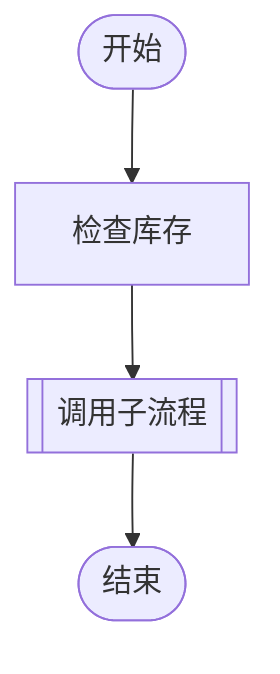
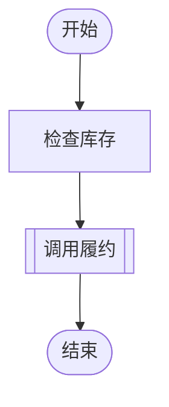
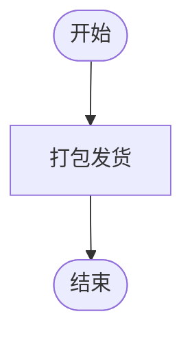

# MD 多流程自动加载实现计划

> **For agentic workers:** REQUIRED SUB-SKILL: Use superpowers:subagent-driven-development (recommended) or superpowers:executing-plans to implement this plan task-by-task. Steps use checkbox (`- [ ]`) syntax for tracking.

**Goal:** Boot Starter 按 `flow-engine.flows.locations`（默认 `classpath*:flows/*.md`）自动扫描 MD 文件，按一级标题切分为多个流程并原子注册，同时提供 `FlowSource` SPI 供后续 Nacos 等外部数据源接入。

**Architecture:** core 仅新增 `FlowSource`/`FlowDocument` 两个纯契约；starter 内实现 `MarkdownFlowParser`（H1 前缀切片，行号与原文件对齐）、`LocalMarkdownFlowSource`（classpath/文件系统解析）、`FlowSourceRegistrar`（`SmartInitializingSingleton` 单次 `registerAll`）。spec 见 `docs/superpowers/specs/2026-10-01-md-multi-flow-auto-load-design.md`。

**Tech Stack:** Java 17、Maven 多模块、Spring Boot 4.1.1（starter 已依赖）、JUnit 5 + AssertJ、Spring `PathMatchingResourcePatternResolver`。

## Global Constraints

- 中文 Javadoc：每个命名生产类型（含嵌套类）写职责/生命周期/线程安全/限制；公共方法写 @param/@return/@throws；record 组件必须 @param。
- Checkstyle（`mvn verify` 强制）：120 列；每行一条语句、一个变量声明；除白名单 `i`/`j`/`k`（循环与 lambda）、`id`、`to` 外，变量/参数/字段/record 组件名不得少于 3 个字符；无通配符 import；import 分组顺序 `io.github.*` → 空行 → `org.springframework.*` → 空行 → `java.*` → 空行 → `static`。
- 错误用 `io.github.mchgood.flow.exception.FlowException(String code, String message)`，负例断言 `code()` 与副作用信息（消息含文件:行号）。
- 自动加载只注册、绝不执行；测试需要引擎关闭/清理时放 `finally`。
- 覆盖率门槛：aggregate LINE ≥ 95%、BRANCH ≥ 88%，不许降阈值；最终门禁 `mvn verify` + `python3 scripts/check-coverage.py`（verify 已含 test，不单独跑 test）。
- 默认值：`flow-engine.flows.enabled=true`、`flow-engine.flows.locations=[classpath*:flows/*.md]`；flowId 规则 `[a-z][A-Za-z0-9]*`（与 FlowCompiler.java:71 一致）。
- 新增错误码仅 `INVALID_FLOW_HEADING`；其余复用既有错误码（`MERMAID_BLOCK_COUNT`、`DEFINITION_LIMIT`、`DUPLICATE_FLOW`）。

---

### Task 1: core SPI 契约（FlowDocument + FlowSource）

**Files:**
- Create: `flow-engine-core/src/main/java/io/github/mchgood/flow/spi/FlowDocument.java`
- Create: `flow-engine-core/src/main/java/io/github/mchgood/flow/spi/FlowSource.java`
- Modify: `flow-engine-core/src/main/java/io/github/mchgood/flow/spi/package-info.java:1-4`

**Interfaces:**
- Consumes: 无
- Produces: `record FlowDocument(String sourceName, String markdown)`；`interface FlowSource { String name(); List<FlowDocument> load(); }`（Task 2/4/5 消费）

- [ ] **Step 1: 创建 FlowDocument**

```java
package io.github.mchgood.flow.spi;

/**
 * 一份待解析的流程文档原文及其来源标识。
 * <p>不可变值对象。sourceName 仅用于错误定位与冲突提示（如资源 URL、外部配置 dataId），
 * 不参与编译语义；markdown 为整份文档原文，由加载器按一级标题切分。
 *
 * @param sourceName 来源标识，非空
 * @param markdown 整份文档原文，UTF-8 文本，非空
 */
public record FlowDocument(String sourceName, String markdown) {
}
```

- [ ] **Step 2: 创建 FlowSource**

```java
package io.github.mchgood.flow.spi;

import java.util.List;

/**
 * 流程文档来源扩展点。实现方提供一批 Markdown 文档，由自动加载器统一按一级标题切分注册。
 * <p>实现需线程安全且可被多次调用；每次调用返回当时的完整文档集，框架不缓存返回值。
 * 内置实现见 starter 的 LocalMarkdownFlowSource；外部数据源（如 Nacos）实现本接口即可接入。
 *
 * @see FlowDocument
 */
public interface FlowSource {

    /**
     * 来源实例名，用于跨来源冲突与失败信息。
     *
     * @return 稳定的非空名称
     */
    String name();

    /**
     * 加载全部文档。
     *
     * @return 文档列表，可为空列表，元素非 null
     * @throws RuntimeException 读取失败时抛出非受检异常，导致自动加载启动失败
     */
    List<FlowDocument> load();
}
```

- [ ] **Step 3: 更新 spi 包说明**

将 `flow-engine-core/src/main/java/io/github/mchgood/flow/spi/package-info.java` 全文替换为：

```java
/**
 * 节点解析、条件编译求值及流程文档来源扩展；实现需支持并发注册或执行，
 * 来源实现需线程安全且可重复调用。
 */
package io.github.mchgood.flow.spi;
```

- [ ] **Step 4: 编译验证**

Run: `mvn -q -pl flow-engine-core compile`
Expected: BUILD SUCCESS

- [ ] **Step 5: Commit**

```bash
git add flow-engine-core/src/main/java/io/github/mchgood/flow/spi/
git commit -m "feat(core): add flow document source spi contracts"
```

---

### Task 2: MarkdownFlowParser（TDD）

**Files:**
- Create: `flow-engine-spring-boot-starter/src/test/java/io/github/mchgood/flow/boot/flows/MarkdownFlowParserTest.java`
- Create: `flow-engine-spring-boot-starter/src/main/java/io/github/mchgood/flow/boot/flows/MarkdownFlowParser.java`

**Interfaces:**
- Consumes: `FlowException(code, message)`（core）
- Produces: `public Map<String, String> split(String sourceName, String markdown)` — 有序 `LinkedHashMap`（flowId → 前缀切片段落）；无标题无 mermaid 返回 `Map.of()`；抛 `FlowException`（`INVALID_FLOW_HEADING` / `MERMAID_BLOCK_COUNT` / `DEFINITION_LIMIT`）

- [ ] **Step 1: 写失败测试**

```java
package io.github.mchgood.flow.boot.flows;

import io.github.mchgood.flow.exception.FlowException;

import org.junit.jupiter.api.Test;

import java.util.Map;

import static org.assertj.core.api.Assertions.assertThat;
import static org.junit.jupiter.api.Assertions.assertThrows;

/**
 * 验证一级标题切分、围栏与深层标题识别、行号保持以及各类非法文档的报错定位。
 */
class MarkdownFlowParserTest {
    private final MarkdownFlowParser parser = new MarkdownFlowParser();

    @Test
    void splitsTwoHeadingsInFileOrderAndKeepsFileLines() {
        String md = String.join("\n",
            "intro text",
            "# alpha",
            "```mermaid",
            "flowchart TD",
            "    start([s]) --> finish([f])",
            "```",
            "# beta",
            "```mermaid",
            "flowchart TD",
            "    start([s]) --> finish([f])",
            "```");
        Map<String, String> sections = parser.split("file.md", md);
        assertThat(sections.keySet()).containsExactly("alpha", "beta");
        assertThat(sections.get("alpha").split("\n", -1)).hasSize(7);
        assertThat(sections.get("alpha").split("\n", -1)[0]).isEqualTo("intro text");
        assertThat(sections.get("beta").split("\n", -1)).hasSize(11);
        assertThat(sections.get("beta").split("\n", -1)[6]).isEqualTo("# beta");
    }

    @Test
    void headingInsideFenceDoesNotSplit() {
        String md = String.join("\n",
            "# alpha",
            "```mermaid",
            "flowchart TD",
            "    start([s]) --> finish([f])",
            "```",
            "```text",
            "# inside",
            "```");
        assertThat(parser.split("file.md", md).keySet()).containsExactly("alpha");
    }

    @Test
    void deeperHeadingsDoNotSplit() {
        String md = String.join("\n",
            "# alpha",
            "## sub heading",
            "### deeper",
            "```mermaid",
            "flowchart TD",
            "    start([s]) --> finish([f])",
            "```");
        assertThat(parser.split("file.md", md).keySet()).containsExactly("alpha");
    }

    @Test
    void trailingHashesAreStripped() {
        String md = String.join("\n",
            "# alpha #",
            "```mermaid",
            "flowchart TD",
            "    start([s]) --> finish([f])",
            "```");
        assertThat(parser.split("file.md", md).keySet()).containsExactly("alpha");
    }

    @Test
    void invalidHeadingFailsWithSourceAndLine() {
        String md = String.join("\n",
            "intro",
            "# Bad-Name",
            "```mermaid",
            "flowchart TD",
            "    start([s]) --> finish([f])",
            "```");
        FlowException failure = assertThrows(FlowException.class, () -> parser.split("file.md", md));
        assertThat(failure.code()).isEqualTo("INVALID_FLOW_HEADING");
        assertThat(failure.getMessage()).contains("file.md:2").contains("Bad-Name");
    }

    @Test
    void duplicateHeadingFailsWithLine() {
        String md = String.join("\n",
            "# alpha",
            "```mermaid",
            "flowchart TD",
            "    start([s]) --> finish([f])",
            "```",
            "# alpha",
            "```mermaid",
            "flowchart TD",
            "    start([s]) --> finish([f])",
            "```");
        FlowException failure = assertThrows(FlowException.class, () -> parser.split("file.md", md));
        assertThat(failure.code()).isEqualTo("INVALID_FLOW_HEADING");
        assertThat(failure.getMessage()).contains("Duplicate").contains("file.md:6");
    }

    @Test
    void mermaidBeforeFirstHeadingFails() {
        String md = String.join("\n",
            "```mermaid",
            "flowchart TD",
            "    start([s]) --> finish([f])",
            "```",
            "# alpha",
            "```mermaid",
            "flowchart TD",
            "    start([s]) --> finish([f])",
            "```");
        FlowException failure = assertThrows(FlowException.class, () -> parser.split("file.md", md));
        assertThat(failure.code()).isEqualTo("MERMAID_BLOCK_COUNT");
        assertThat(failure.getMessage()).contains("file.md:1");
    }

    @Test
    void mermaidWithoutAnyHeadingFails() {
        String md = String.join("\n",
            "```mermaid",
            "flowchart TD",
            "    start([s]) --> finish([f])",
            "```");
        FlowException failure = assertThrows(FlowException.class, () -> parser.split("file.md", md));
        assertThat(failure.code()).isEqualTo("MERMAID_BLOCK_COUNT");
        assertThat(failure.getMessage()).contains("file.md:1");
    }

    @Test
    void sectionWithoutMermaidFails() {
        String md = "# alpha\njust text, no diagram\n";
        FlowException failure = assertThrows(FlowException.class, () -> parser.split("file.md", md));
        assertThat(failure.code()).isEqualTo("MERMAID_BLOCK_COUNT");
        assertThat(failure.getMessage()).contains("alpha").contains("file.md:1");
    }

    @Test
    void plainNotesAreSkipped() {
        assertThat(parser.split("file.md", "just notes\nmore notes\n")).isEmpty();
    }

    @Test
    void crlfAndBomAreHandled() {
        String md = "# alpha\r\n```mermaid\r\nflowchart TD\r\n    start([s]) --> finish([f])\r\n```";
        Map<String, String> sections = parser.split("file.md", md);
        assertThat(sections.keySet()).containsExactly("alpha");
        assertThat(sections.get("alpha").split("\n", -1)).hasSize(5);
    }
}
```

- [ ] **Step 2: 运行确认失败**

Run: `mvn -q -pl flow-engine-spring-boot-starter -am test -Dtest=MarkdownFlowParserTest`
Expected: COMPILATION ERROR（`MarkdownFlowParser` 不存在）

- [ ] **Step 3: 实现**

```java
package io.github.mchgood.flow.boot.flows;

import io.github.mchgood.flow.exception.FlowException;

import java.util.ArrayList;
import java.util.Arrays;
import java.util.LinkedHashMap;
import java.util.List;
import java.util.Map;
import java.util.regex.Matcher;
import java.util.regex.Pattern;

/**
 * 将整份 Markdown 文档按一级标题切分为多个流程段落。
 * <p>仅 ATX 一级标题（单个 # 加空白）开启新段落，标题文本即 flowId，须匹配小驼峰规则；
 * 围栏代码块内的 # 行不参与切分。段落输出采用前缀切片：从文件第 1 行到下一个一级标题之前，
 * 保证核心编译器报错行号与原文件一致。首个标题前的导语被忽略，但导语中不得出现 mermaid
 * 围栏块。本类无状态、线程安全；不解析 Mermaid 图形，图形校验由核心编译器完成。
 * <p>限制：标题去首尾空白后必须匹配 [a-z][A-Za-z0-9]*；同一文件重复标题、段落缺少 mermaid
 * 块均报错；既无标题也无 mermaid 块的文档返回空映射（视为纯说明文档）。
 */
public final class MarkdownFlowParser {
    private static final Pattern FLOW_ID = Pattern.compile("[a-z][A-Za-z0-9]*");
    private static final Pattern HEADING = Pattern.compile("^ {0,3}#[ \t]+(.+?)[ \t]*#*[ \t]*$");
    private static final Pattern FENCE = Pattern.compile("^ {0,3}(`{3,}|~{3,})[ \t]*(.*)$");

    /**
     * 按一级标题切分文档。
     *
     * @param sourceName 来源标识，仅用于错误信息定位
     * @param markdown 整份文档原文；null 视为缺失内容
     * @return flowId 到段落 Markdown 的有序映射（保持文件内标题顺序）；无标题时为空映射
     * @throws FlowException INVALID_FLOW_HEADING 标题非法或重复；MERMAID_BLOCK_COUNT
     *         导语含 mermaid 块、文档含 mermaid 块但无标题或段落缺少 mermaid 块；
     *         DEFINITION_LIMIT 文档缺失
     */
    public Map<String, String> split(String sourceName, String markdown) {
        if (markdown == null) {
            throw new FlowException("DEFINITION_LIMIT", "Markdown missing for " + sourceName);
        }
        String[] lines = markdown.replaceFirst("^\\uFEFF", "").split("\n", -1);
        List<Integer> headingLines = new ArrayList<>();
        List<String> flowIds = new ArrayList<>();
        List<Integer> mermaidLines = new ArrayList<>();
        List<Integer> mermaidSections = new ArrayList<>();
        char fenceChar = 0;
        int fenceLength = 0;
        int currentSection = -1;
        for (int i = 0; i < lines.length; i++) {
            String line = lines[i].endsWith("\r") ? lines[i].substring(0, lines[i].length() - 1) : lines[i];
            if (fenceLength > 0) {
                if (closesFence(line, fenceChar, fenceLength)) {
                    fenceChar = 0;
                    fenceLength = 0;
                }
                continue;
            }
            Matcher fence = FENCE.matcher(line);
            if (fence.matches()) {
                fenceChar = fence.group(1).charAt(0);
                fenceLength = fence.group(1).length();
                if ("mermaid".equals(fence.group(2).trim())) {
                    mermaidLines.add(i);
                    mermaidSections.add(currentSection);
                }
                continue;
            }
            Matcher heading = HEADING.matcher(line);
            if (heading.matches()) {
                String title = heading.group(1).trim();
                if (!FLOW_ID.matcher(title).matches()) {
                    throw new FlowException("INVALID_FLOW_HEADING",
                        "Level-1 heading must match [a-z][A-Za-z0-9]* at " + sourceName + ":" + (i + 1)
                            + " but was \"" + title + "\"");
                }
                if (flowIds.contains(title)) {
                    throw new FlowException("INVALID_FLOW_HEADING",
                        "Duplicate level-1 heading \"" + title + "\" at " + sourceName + ":" + (i + 1));
                }
                headingLines.add(i);
                flowIds.add(title);
                currentSection = headingLines.size() - 1;
            }
        }
        for (int j = 0; j < mermaidLines.size(); j++) {
            if (mermaidSections.get(j) < 0) {
                throw new FlowException("MERMAID_BLOCK_COUNT",
                    "Mermaid block before any level-1 heading at " + sourceName + ":" + (mermaidLines.get(j) + 1));
            }
        }
        if (headingLines.isEmpty()) {
            if (!mermaidLines.isEmpty()) {
                throw new FlowException("MERMAID_BLOCK_COUNT",
                    "Mermaid block without level-1 heading at " + sourceName + ":" + (mermaidLines.get(0) + 1));
            }
            return Map.of();
        }
        for (int k = 0; k < headingLines.size(); k++) {
            if (!mermaidSections.contains(k)) {
                throw new FlowException("MERMAID_BLOCK_COUNT",
                    "Expected one mermaid block under heading \"" + flowIds.get(k) + "\" at "
                        + sourceName + ":" + (headingLines.get(k) + 1));
            }
        }
        Map<String, String> sections = new LinkedHashMap<>();
        List<String> view = Arrays.asList(lines);
        for (int k = 0; k < headingLines.size(); k++) {
            int end = k + 1 < headingLines.size() ? headingLines.get(k + 1) : lines.length;
            sections.put(flowIds.get(k), String.join("\n", view.subList(0, end)));
        }
        return sections;
    }

    private boolean closesFence(String line, char fenceChar, int fenceLength) {
        int spaces = 0;
        while (spaces < line.length() && line.charAt(spaces) == ' ') {
            spaces++;
        }
        if (spaces > 3 || spaces >= line.length() || line.charAt(spaces) != fenceChar) {
            return false;
        }
        int length = 0;
        int index = spaces;
        while (index < line.length() && line.charAt(index) == fenceChar) {
            length++;
            index++;
        }
        return length >= fenceLength && line.substring(index).isBlank();
    }
}
```

- [ ] **Step 4: 运行确认通过**

Run: `mvn -q -pl flow-engine-spring-boot-starter -am test -Dtest=MarkdownFlowParserTest`
Expected: Tests run: 10, Failures: 0, Errors: 0

- [ ] **Step 5: Commit**

```bash
git add flow-engine-spring-boot-starter/src
git commit -m "feat(boot): split multi-flow markdown by level-1 headings"
```

---

### Task 3: FlowEngineProperties 增加 flows 嵌套配置（TDD）

**Files:**
- Modify: `flow-engine-spring-boot-starter/src/main/java/io/github/mchgood/flow/boot/autoconfigure/FlowEngineProperties.java`
- Modify: `flow-engine-spring-boot-starter/src/test/java/io/github/mchgood/flow/boot/autoconfigure/FlowEngineAutoConfigurationTest.java`

**Interfaces:**
- Consumes: 无
- Produces: `FlowEngineProperties.getFlows()` 返回嵌套类实例：`boolean isEnabled()`（默认 true）、`List<String> getLocations()`（默认 `List.of("classpath*:flows/*.md")`）及对应 setter（Task 5 装配消费）

- [ ] **Step 1: 写失败测试**

在 `FlowEngineAutoConfigurationTest` 的 `bindsAllResourceProperties` 方法之后新增两个测试：

```java
    @Test
    void flowsAutoLoadHasDefaults() {
        runner.run(context -> {
            var flows = context.getBean(FlowEngineProperties.class).getFlows();
            assertThat(flows.isEnabled()).isTrue();
            assertThat(flows.getLocations()).containsExactly("classpath*:flows/*.md");
        });
    }

    @Test
    void bindsFlowsAutoLoadProperties() {
        runner.withPropertyValues("flow-engine.flows.enabled=false",
            "flow-engine.flows.locations[0]=classpath:custom/*.md",
            "flow-engine.flows.locations[1]=file:./flows/*.md").run(context -> {
                assertThat(context).hasNotFailed();
                var flows = context.getBean(FlowEngineProperties.class).getFlows();
                assertThat(flows.isEnabled()).isFalse();
                assertThat(flows.getLocations()).containsExactly("classpath:custom/*.md", "file:./flows/*.md");
            });
    }
```

并把 `publishesIdeConfigurationMetadata` 的断言列表扩展为：

```java
            assertThat(metadata).contains("flow-engine.worker-threads", "flow-engine.enabled",
                    "flow-engine.node-timeout", "flow-engine.flows.enabled", "flow-engine.flows.locations");
```

- [ ] **Step 2: 运行确认失败**

Run: `mvn -q -pl flow-engine-spring-boot-starter -am test "-Dtest=FlowEngineAutoConfigurationTest#flowsAutoLoadHasDefaults+bindsFlowsAutoLoadProperties+publishesIdeConfigurationMetadata"`
Expected: FAIL（`getFlows()` 不存在 / metadata 缺键）

- [ ] **Step 3: 实现**

`FlowEngineProperties.java`：import 区加 `import java.util.List;`（放在 `java.time.Duration;` 之后）。字段区（`closeTimeout` 字段之后）加：

```java
    private final Flows flows = new Flows();
```

类尾部（`toEngineConfig()` 之前）加：

```java
    /**
     * 读取流程文件自动加载配置。
     *
     * @return 自动加载嵌套配置，永不为 null
     */
    public Flows getFlows() {
        return flows;
    }

    /**
     * 流程文件自动加载配置（前缀 flow-engine.flows）。
     * <p>enabled 为 false 时整个自动加载子系统关闭：不创建本地来源与注册器，
     * 用户自定义 FlowSource Bean 同样不被消费。
     */
    public static class Flows {
        /**
         * 是否启用自动加载，默认 true。
         */
        private boolean enabled = true;

        /**
         * 扫描位置列表，默认 classpath*:flows/*.md；每项为 Ant 模式或具体文件路径。
         */
        private List<String> locations = List.of("classpath*:flows/*.md");

        /**
         * 读取是否启用自动加载，默认 true。
         *
         * @return 是否启用自动加载，默认 true
         */
        public boolean isEnabled() {
            return enabled;
        }

        /**
         * 绑定是否启用自动加载，默认 true。
         *
         * @param enabled 配置值
         */
        public void setEnabled(boolean enabled) {
            this.enabled = enabled;
        }

        /**
         * 读取扫描位置列表，默认 classpath*:flows/*.md。
         *
         * @return 位置列表，不可为 null
         */
        public List<String> getLocations() {
            return locations;
        }

        /**
         * 绑定扫描位置列表，整体替换默认值。
         *
         * @param locations 位置列表，不可为 null
         */
        public void setLocations(List<String> locations) {
            this.locations = List.copyOf(locations);
        }
    }
```

同时更新类级 Javadoc 第二段，说明自动加载配置含义：在 `<p>默认资源值来自...` 段之后补一句：

```java
 * <p>flows 嵌套配置控制启动期流程文件自动加载；关闭后不扫描文件也不消费自定义 FlowSource Bean。
```

- [ ] **Step 4: 运行确认通过**

Run: `mvn -q -pl flow-engine-spring-boot-starter -am test -Dtest=FlowEngineAutoConfigurationTest`
Expected: 全部 PASS（新增 3 处 + 既有 17 个）

- [ ] **Step 5: Commit**

```bash
git add flow-engine-spring-boot-starter/src
git commit -m "feat(boot): bind flow-engine.flows auto-load properties"
```

---

### Task 4: LocalMarkdownFlowSource（TDD）

**Files:**
- Create: `flow-engine-spring-boot-starter/src/main/java/io/github/mchgood/flow/boot/flows/LocalMarkdownFlowSource.java`
- Create: `flow-engine-spring-boot-starter/src/test/java/io/github/mchgood/flow/boot/flows/LocalMarkdownFlowSourceTest.java`
- Create: `flow-engine-spring-boot-starter/src/test/resources/it/flows/child.md`
- Create: `flow-engine-spring-boot-starter/src/test/resources/it/flows/order.md`
- Create: `flow-engine-spring-boot-starter/src/test/resources/it/flows/notes.txt`
- Create: `flow-engine-spring-boot-starter/src/main/java/io/github/mchgood/flow/boot/flows/package-info.java`

**Interfaces:**
- Consumes: `FlowSource`/`FlowDocument`（Task 1）
- Produces: `public LocalMarkdownFlowSource(List<String> locations)`、包私有 `LocalMarkdownFlowSource(List<String>, ResourcePatternResolver)`（测试注入）；`name()` 返回 `"local"`；`load()` 返回按 URL 排序的 `.md` 文档列表

- [ ] **Step 1: 创建测试资源**

`flow-engine-spring-boot-starter/src/test/resources/it/flows/child.md`（内容如下，含围栏）：

````markdown
# childFlow


````

`flow-engine-spring-boot-starter/src/test/resources/it/flows/order.md`：

````markdown
# orderFlow


````

`flow-engine-spring-boot-starter/src/test/resources/it/flows/notes.txt`：

```
not a markdown flow
```

- [ ] **Step 2: 写失败测试**

```java
package io.github.mchgood.flow.boot.flows;

import io.github.mchgood.flow.spi.FlowDocument;

import org.junit.jupiter.api.Test;
import org.junit.jupiter.api.io.TempDir;
import org.springframework.core.io.ByteArrayResource;
import org.springframework.core.io.Resource;
import org.springframework.core.io.support.ResourcePatternResolver;

import java.io.IOException;
import java.io.UncheckedIOException;
import java.nio.charset.StandardCharsets;
import java.nio.file.Files;
import java.nio.file.Path;
import java.util.List;

import static org.assertj.core.api.Assertions.assertThat;
import static org.assertj.core.api.Assertions.assertThatThrownBy;

/**
 * 验证本地来源的 classpath 与文件系统解析、确定性排序、忽略规则及 fail-fast 读取。
 */
class LocalMarkdownFlowSourceTest {

    @Test
    void loadsClasspathMarkdownSortedAndSkipsOtherFiles() {
        LocalMarkdownFlowSource source = new LocalMarkdownFlowSource(List.of("classpath*:it/flows/*.md"));
        List<FlowDocument> documents = source.load();
        assertThat(documents).hasSize(2);
        assertThat(documents).extracting(FlowDocument::sourceName).isSorted();
        assertThat(documents.get(0).markdown()).contains("# childFlow");
        assertThat(documents.get(1).markdown()).contains("# orderFlow");
    }

    @Test
    void zeroMatchesAndEmptyLocationsAreSilent() {
        assertThat(new LocalMarkdownFlowSource(List.of("classpath*:it/absent/*.md")).load()).isEmpty();
        assertThat(new LocalMarkdownFlowSource(List.of()).load()).isEmpty();
    }

    @Test
    void readsFileSystemDirectoryIgnoringNonMarkdown(@TempDir Path dir) throws IOException {
        Files.writeString(dir.resolve("b.md"), "# bFlow\n");
        Files.writeString(dir.resolve("a.md"), "# aFlow\n");
        Files.writeString(dir.resolve("ignore.txt"), "skip");
        LocalMarkdownFlowSource source = new LocalMarkdownFlowSource(List.of("file:" + dir + "/*.md"));
        List<FlowDocument> documents = source.load();
        assertThat(documents).extracting(FlowDocument::markdown).containsExactly("# aFlow\n", "# bFlow\n");
    }

    @Test
    void missingConcreteFileFailsFast() {
        LocalMarkdownFlowSource source = new LocalMarkdownFlowSource(List.of("file:/definitely/absent/flow.md"));
        assertThatThrownBy(source::load).isInstanceOf(UncheckedIOException.class).
            hasMessageContaining("file:/definitely/absent/flow.md");
    }

    @Test
    void resolveFailureFailsFast() {
        LocalMarkdownFlowSource source = new LocalMarkdownFlowSource(List.of("bad"), failingResolver());
        assertThatThrownBy(source::load).isInstanceOf(UncheckedIOException.class).
            hasMessageContaining("bad").hasCauseInstanceOf(IOException.class);
    }

    @Test
    void unreadableUrlFailsFast() {
        Resource resource = new ByteArrayResource("x".getBytes(StandardCharsets.UTF_8)) {
            @Override
            public String getFilename() {
                return "broken.md";
            }
        };
        LocalMarkdownFlowSource source = new LocalMarkdownFlowSource(List.of("mock"), fixedResolver(resource));
        assertThatThrownBy(source::load).isInstanceOf(UncheckedIOException.class).
            hasMessageContaining("Failed to resolve flow resource URL");
    }

    private ResourcePatternResolver failingResolver() {
        return new ResourcePatternResolver() {
            @Override
            public Resource[] getResources(String location) throws IOException {
                throw new IOException("boom");
            }

            @Override
            public Resource getResource(String location) {
                throw new UnsupportedOperationException();
            }

            @Override
            public ClassLoader getClassLoader() {
                return getClass().getClassLoader();
            }
        };
    }

    private ResourcePatternResolver fixedResolver(Resource resource) {
        return new ResourcePatternResolver() {
            @Override
            public Resource[] getResources(String location) {
                return new Resource[] {resource};
            }

            @Override
            public Resource getResource(String location) {
                return resource;
            }

            @Override
            public ClassLoader getClassLoader() {
                return getClass().getClassLoader();
            }
        };
    }
}
```

- [ ] **Step 3: 运行确认失败**

Run: `mvn -q -pl flow-engine-spring-boot-starter -am test -Dtest=LocalMarkdownFlowSourceTest`
Expected: COMPILATION ERROR（`LocalMarkdownFlowSource` 不存在）

- [ ] **Step 4: 实现**

```java
package io.github.mchgood.flow.boot.flows;

import io.github.mchgood.flow.spi.FlowDocument;
import io.github.mchgood.flow.spi.FlowSource;

import org.springframework.core.io.Resource;
import org.springframework.core.io.support.PathMatchingResourcePatternResolver;
import org.springframework.core.io.support.ResourcePatternResolver;

import java.io.IOException;
import java.io.InputStream;
import java.io.UncheckedIOException;
import java.nio.charset.StandardCharsets;
import java.util.ArrayList;
import java.util.Arrays;
import java.util.Comparator;
import java.util.List;

/**
 * 从 classpath 或文件系统位置读取 Markdown 流程文档的内置来源。
 * <p>每个位置为 Ant 模式或具体文件路径，支持 classpath:、classpath*:、file: 与绝对路径，
 * 经 PathMatchingResourcePatternResolver 解析。模式零匹配属正常情况，静默返回空列表；
 * 具体路径的资源必须可读，打开或读取失败抛 UncheckedIOException，由自动加载转为启动失败。
 * 匹配按资源 URL 排序保证确定性；文件名不以 .md 结尾的资源忽略。本类不可变、线程安全，
 * 每次 load() 重新扫描。
 */
public final class LocalMarkdownFlowSource implements FlowSource {
    private final List<String> locations;
    private final ResourcePatternResolver resolver;

    /**
     * 使用默认解析器创建本地来源。
     *
     * @param locations Ant 模式或具体文件路径列表，可为空列表
     */
    public LocalMarkdownFlowSource(List<String> locations) {
        this(locations, new PathMatchingResourcePatternResolver());
    }

    /**
     * 使用指定解析器创建本地来源，便于测试注入。
     *
     * @param locations Ant 模式或具体文件路径列表
     * @param resolver 资源模式解析器
     */
    LocalMarkdownFlowSource(List<String> locations, ResourcePatternResolver resolver) {
        this.locations = List.copyOf(locations);
        this.resolver = resolver;
    }

    @Override
    public String name() {
        return "local";
    }

    @Override
    public List<FlowDocument> load() {
        List<Resource> matched = new ArrayList<>();
        for (String location : locations) {
            try {
                matched.addAll(Arrays.asList(resolver.getResources(location)));
            } catch (IOException e) {
                throw new UncheckedIOException("Failed to resolve flow location " + location, e);
            }
        }
        matched.sort(Comparator.comparing(this::urlOf));
        List<FlowDocument> documents = new ArrayList<>();
        for (Resource resource : matched) {
            String filename = resource.getFilename();
            if (filename == null || !filename.endsWith(".md")) {
                continue;
            }
            documents.add(new FlowDocument(urlOf(resource), read(resource)));
        }
        return List.copyOf(documents);
    }

    private String urlOf(Resource resource) {
        try {
            return resource.getURL().toString();
        } catch (IOException e) {
            throw new UncheckedIOException("Failed to resolve flow resource URL", e);
        }
    }

    private String read(Resource resource) {
        try (InputStream in = resource.getInputStream()) {
            return new String(in.readAllBytes(), StandardCharsets.UTF_8);
        } catch (IOException e) {
            throw new UncheckedIOException("Failed to read flow resource " + urlOf(resource), e);
        }
    }
}
```

`flow-engine-spring-boot-starter/src/main/java/io/github/mchgood/flow/boot/flows/package-info.java`：

```java
/**
 * 流程文件自动加载：按一级标题切分多流程 Markdown，从可配置位置读取并在单例就绪后
 * 原子注册；只注册、绝不执行，失败使应用启动失败。外部数据源通过实现 spi 的
 * FlowSource 接入，无需修改本包。
 */
package io.github.mchgood.flow.boot.flows;
```

- [ ] **Step 5: 运行确认通过**

Run: `mvn -q -pl flow-engine-spring-boot-starter -am test -Dtest=LocalMarkdownFlowSourceTest`
Expected: Tests run: 6, Failures: 0, Errors: 0

- [ ] **Step 6: Commit**

```bash
git add flow-engine-spring-boot-starter/src
git commit -m "feat(boot): load markdown flow documents from local locations"
```

---

### Task 5: FlowSourceRegistrar + 自动装配（TDD 集成）

**Files:**
- Create: `flow-engine-spring-boot-starter/src/main/java/io/github/mchgood/flow/boot/flows/FlowSourceRegistrar.java`
- Create: `flow-engine-spring-boot-starter/src/test/java/io/github/mchgood/flow/boot/flows/FlowSourceRegistrarTest.java`
- Create: `flow-engine-spring-boot-starter/src/test/resources/flows/order.md`
- Create: `flow-engine-spring-boot-starter/src/test/resources/flows/fulfillment.md`
- Modify: `flow-engine-spring-boot-starter/src/main/java/io/github/mchgood/flow/boot/autoconfigure/FlowEngineAutoConfiguration.java`
- Modify: `flow-engine-spring-boot-starter/src/test/java/io/github/mchgood/flow/boot/autoconfigure/FlowEngineAutoConfigurationTest.java`

**Interfaces:**
- Consumes: `FlowEngine.registerAll(Map<String,String>)`、`FlowException(code, message)`、Task 2 `MarkdownFlowParser.split`、Task 3 `FlowEngineProperties.getFlows()`、Task 4 `LocalMarkdownFlowSource(List<String>)`
- Produces: `FlowSourceRegistrar(ObjectProvider<FlowEngine>, ObjectProvider<FlowSource>) implements SmartInitializingSingleton`；AutoConfiguration 新增 Bean `localMarkdownFlowSource`（`@ConditionalOnMissingBean(FlowSource.class)`）与 `flowSourceRegistrar`

- [ ] **Step 1: 创建默认路径测试资源**

`flow-engine-spring-boot-starter/src/test/resources/flows/order.md`：

````markdown
# orderFlow


````

`flow-engine-spring-boot-starter/src/test/resources/flows/fulfillment.md`：

````markdown
# fulfillment


````

- [ ] **Step 2: 写失败集成测试**

```java
package io.github.mchgood.flow.boot.flows;

import io.github.mchgood.flow.api.FlowEngine;
import io.github.mchgood.flow.exception.FlowException;
import io.github.mchgood.flow.node.FlowNode;
import io.github.mchgood.flow.runtime.DefaultFlowEngine;
import io.github.mchgood.flow.spi.FlowDocument;
import io.github.mchgood.flow.spi.FlowSource;
import io.github.mchgood.flow.spring.SpelConditionEvaluator;

import org.junit.jupiter.api.Test;
import org.springframework.beans.factory.BeanPostProcessor;
import org.springframework.boot.autoconfigure.AutoConfigurations;
import org.springframework.boot.test.context.runner.ApplicationContextRunner;
import org.springframework.context.annotation.Configuration;
import org.springframework.context.support.StaticApplicationContext;

import java.util.List;
import java.util.concurrent.atomic.AtomicInteger;

import static org.assertj.core.api.Assertions.assertThat;
import static org.junit.jupiter.api.Assertions.assertThrows;

/**
 * 验证自动加载的默认路径、开关、来源扩展点、fail-fast 与引擎覆盖场景。
 */
class FlowSourceRegistrarTest {
    private static final String PLAIN = """

        ```mermaid
        flowchart TD
            start([开始]) --> check["检查"]
            check --> finish([结束])
        ```
        """;

    private final ApplicationContextRunner runner = new ApplicationContextRunner().
        withConfiguration(AutoConfigurations.of(FlowEngineAutoConfiguration.class)).
        withUserConfiguration(AutoLoadNodes.class);

    @Test
    void loadsFlowsFromDefaultClasspathLocation() {
        runner.run(context -> {
            assertThat(context).hasNotFailed();
            FlowEngine engine = context.getBean(FlowEngine.class);
            FlowException failure = assertThrows(FlowException.class, () -> engine.register("orderFlow", PLAIN));
            assertThat(failure.code()).isEqualTo("DUPLICATE_FLOW");
            assertThat(engine.execute("orderFlow", null).succeeded()).isTrue();
        });
    }

    @Test
    void flowsEnabledFalseSkipsLoading() {
        runner.withPropertyValues("flow-engine.flows.enabled=false").run(context -> {
            assertThat(context).hasNotFailed().
                doesNotHaveBean(LocalMarkdownFlowSource.class).doesNotHaveBean(FlowSourceRegistrar.class);
            context.getBean(FlowEngine.class).register("orderFlow", PLAIN);
        });
    }

    @Test
    void customSourceReplacesLocalSource() {
        TestSource source = new TestSource("custom",
            List.of(new FlowDocument("memory:custom.md", document("customFlow"))), new AtomicInteger());
        runner.withBean(FlowSource.class, () -> source).run(context -> {
            assertThat(context).hasNotFailed().doesNotHaveBean(LocalMarkdownFlowSource.class);
            assertThat(context.getBean(FlowEngine.class).execute("customFlow", null).succeeded()).isTrue();
            assertThat(source.loads().get()).isEqualTo(1);
        });
    }

    @Test
    void customEngineStillReceivesLoadedFlows() {
        DefaultFlowEngine engine = new DefaultFlowEngine(id -> node -> context -> context.input(),
            new SpelConditionEvaluator());
        try {
            runner.withBean("customEngine", FlowEngine.class, () -> engine).
                withPropertyValues("flow-engine.flows.locations=classpath*:it/flows/*.md").
                run(context -> {
                    assertThat(context).hasNotFailed();
                    assertThat(context.getBean(FlowEngine.class)).isSameAs(engine);
                    assertThat(engine.execute("orderFlow", null).succeeded()).isTrue();
                });
        } finally {
            engine.close();
        }
    }

    @Test
    void duplicateFlowAcrossSourcesFailsWithBothOrigins() {
        TestSource first = new TestSource("first",
            List.of(new FlowDocument("memory:one.md", document("dupFlow"))), new AtomicInteger());
        TestSource second = new TestSource("second",
            List.of(new FlowDocument("memory:two.md", document("dupFlow"))), new AtomicInteger());
        runner.withBean("firstSource", FlowSource.class, () -> first).
            withBean("secondSource", FlowSource.class, () -> second).
            run(context -> {
                assertThat(context).hasFailed();
                assertThat(context.getStartupFailure()).isInstanceOfSatisfying(FlowException.class, e -> {
                    assertThat(e.code()).isEqualTo("DUPLICATE_FLOW");
                    assertThat(e.getMessage()).contains("first").contains("second");
                });
            });
    }

    @Test
    void invalidDocumentFailsWithSourceContext() {
        TestSource source = new TestSource("custom",
            List.of(new FlowDocument("memory:bad.md", "# Bad-Name\n" + PLAIN)), new AtomicInteger());
        runner.withBean(FlowSource.class, () -> source).run(context -> {
            assertThat(context).hasFailed();
            assertThat(context.getStartupFailure()).isInstanceOfSatisfying(FlowException.class, e -> {
                assertThat(e.code()).isEqualTo("INVALID_FLOW_HEADING");
                assertThat(e.getMessage()).contains("memory:bad.md");
            });
        });
    }

    @Test
    void manualRegistrationConflictFailsStartup() {
        runner.withBean("squatter", BeanPostProcessor.class, () -> new BeanPostProcessor() {
            @Override
            public Object postProcessAfterInitialization(Object bean, String beanName) {
                if (bean instanceof FlowEngine engine) {
                    engine.register("orderFlow", PLAIN);
                }
                return bean;
            }
        }).withPropertyValues("flow-engine.flows.locations=classpath*:it/flows/*.md").
            run(context -> {
                assertThat(context).hasFailed();
                assertThat(context.getStartupFailure()).isInstanceOfSatisfying(FlowException.class,
                    e -> assertThat(e.code()).isEqualTo("DUPLICATE_FLOW"));
            });
    }

    @Test
    void registrarWithoutEngineSkipsSilently() {
        StaticApplicationContext context = new StaticApplicationContext();
        try {
            TestSource source = new TestSource("custom",
                List.of(new FlowDocument("memory:custom.md", document("customFlow"))), new AtomicInteger());
            context.registerBean("probe", FlowSource.class, () -> source);
            context.refresh();
            FlowSourceRegistrar registrar = new FlowSourceRegistrar(context.getBeanProvider(FlowEngine.class),
                context.getBeanProvider(FlowSource.class));
            registrar.afterSingletonsInstantiated();
            assertThat(source.loads().get()).isEqualTo(0);
        } finally {
            context.close();
        }
    }

    private static String document(String flowId) {
        return "# " + flowId + "\n" + PLAIN;
    }

    /**
     * 提供自动加载测试资源所需的 check 与 pack 业务节点。
     */
    @Configuration(proxyBeanMethods = false)
    static class AutoLoadNodes {
        @Bean
        FlowNode<?> check() {
            return context -> context.input();
        }

        @Bean
        FlowNode<?> pack() {
            return context -> context.input();
        }
    }

    /**
     * 测试用来源：记录 load 调用次数并返回固定文档。
     */
    record TestSource(String label, List<FlowDocument> documents, AtomicInteger loads) implements FlowSource {
        @Override
        public String name() {
            return label;
        }

        @Override
        public List<FlowDocument> load() {
            loads.incrementAndGet();
            return documents;
        }
    }
}
```

- [ ] **Step 3: 运行确认失败**

Run: `mvn -q -pl flow-engine-spring-boot-starter -am test -Dtest=FlowSourceRegistrarTest`
Expected: COMPILATION ERROR（`FlowSourceRegistrar` 不存在；`FlowEngineAutoConfiguration` 引用 `FlowSourceRegistrarTest` 包内类失败等编译错）

- [ ] **Step 4: 实现 Registrar**

```java
package io.github.mchgood.flow.boot.flows;

import io.github.mchgood.flow.api.FlowEngine;
import io.github.mchgood.flow.exception.FlowException;
import io.github.mchgood.flow.spi.FlowDocument;
import io.github.mchgood.flow.spi.FlowSource;

import org.springframework.beans.factory.ObjectProvider;
import org.springframework.beans.factory.SmartInitializingSingleton;

import java.util.LinkedHashMap;
import java.util.Map;

/**
 * 汇总全部 FlowSource 文档，按一级标题切分后原子注册到引擎。
 * <p>SmartInitializingSingleton 时机：全部单例就绪后执行一次，因此宿主覆盖 FlowEngine
 * Bean 时自动加载依然生效；无引擎 Bean 时静默跳过。跨来源 flowId 冲突立即失败并附两个
 * 来源名；注册经单次 registerAll 原子发布，跨文件、跨来源子流程引用同批可用。只注册、
 * 绝不执行。仅在单例初始化阶段执行一次，无线程安全问题。
 * <p>限制：与宿主手动注册共用同一命名空间，同 flowId 手动注册会导致 DUPLICATE_FLOW
 * 启动失败，由宿主保证不冲突。
 */
public final class FlowSourceRegistrar implements SmartInitializingSingleton {
    private final ObjectProvider<FlowEngine> engines;
    private final ObjectProvider<FlowSource> sources;
    private final MarkdownFlowParser parser = new MarkdownFlowParser();

    /**
     * 创建注册器。
     *
     * @param engines 引擎提供者，可为空（无引擎时静默跳过）
     * @param sources 来源提供者，可为空
     */
    public FlowSourceRegistrar(ObjectProvider<FlowEngine> engines, ObjectProvider<FlowSource> sources) {
        this.engines = engines;
        this.sources = sources;
    }

    @Override
    public void afterSingletonsInstantiated() {
        FlowEngine engine = engines.getIfAvailable();
        if (engine == null) {
            return;
        }
        Map<String, String> flows = new LinkedHashMap<>();
        Map<String, String> origins = new LinkedHashMap<>();
        for (FlowSource source : sources.orderedStream().toList()) {
            for (FlowDocument document : source.load()) {
                Map<String, String> parsed = parser.split(document.sourceName(), document.markdown());
                for (Map.Entry<String, String> entry : parsed.entrySet()) {
                    if (flows.putIfAbsent(entry.getKey(), entry.getValue()) != null) {
                        throw new FlowException("DUPLICATE_FLOW",
                            "Flow \"" + entry.getKey() + "\" defined in both " + origins.get(entry.getKey())
                                + " and " + document.sourceName());
                    }
                    origins.put(entry.getKey(), document.sourceName());
                }
            }
        }
        if (flows.isEmpty()) {
            return;
        }
        try {
            engine.registerAll(flows);
        } catch (FlowException e) {
            throw new FlowException(e.code(), e.getMessage() + "; flows loaded from sources: " + origins);
        }
    }
}
```

- [ ] **Step 5: 装配自动配置**

`FlowEngineAutoConfiguration.java`：

imports 增加（`io.github` 组）：`io.github.mchgood.flow.boot.flows.FlowSourceRegistrar`、`io.github.mchgood.flow.boot.flows.LocalMarkdownFlowSource`、`io.github.mchgood.flow.spi.FlowSource`；`org.springframework` 组增加：`org.springframework.beans.factory.ObjectProvider`。

类 Javadoc 第 22 行 `节点解析器、条件求值器、资源配置或整个引擎；不会扫描流程文件、注册流程或触发执行。` 替换为：

```java
 * 节点解析器、条件求值器、资源配置或整个引擎。flow-engine.flows.enabled 默认开启时，
 * 在全部单例就绪后把 FlowSource 提供的 Markdown 文档按一级标题切分并原子注册（本地默认
 * 扫描 classpath*:flows/*.md，可用配置覆盖或整体关闭）；绝不触发执行。
```

`flowEngine` 方法之后新增两个工厂：

```java
    /**
     * 装配本地文件流程来源；宿主已定义 FlowSource Bean 时退让。
     *
     * @param properties 已完成绑定的配置属性
     * @return 默认本地来源
     */
    @Bean
    @ConditionalOnMissingBean(FlowSource.class)
    @ConditionalOnProperty(prefix = "flow-engine.flows", name = "enabled", havingValue = "true",
            matchIfMissing = true)
    public LocalMarkdownFlowSource localMarkdownFlowSource(FlowEngineProperties properties) {
        return new LocalMarkdownFlowSource(properties.getFlows().getLocations());
    }

    /**
     * 装配来源注册器，在全部单例就绪后执行一次注册。
     *
     * @param engines 引擎提供者，可为空
     * @param sources 来源提供者，可为空
     * @return 自动加载注册器
     */
    @Bean
    @ConditionalOnProperty(prefix = "flow-engine.flows", name = "enabled", havingValue = "true",
            matchIfMissing = true)
    public FlowSourceRegistrar flowSourceRegistrar(ObjectProvider<FlowEngine> engines,
            ObjectProvider<FlowSource> sources) {
        return new FlowSourceRegistrar(engines, sources);
    }
```

- [ ] **Step 6: 适配既有测试类（默认路径扫描会命中新资源）**

`FlowEngineAutoConfigurationTest.java`：

1. runner 字段改为：

```java
    private final ApplicationContextRunner runner = new ApplicationContextRunner().
        withConfiguration(AutoConfigurations.of(FlowEngineAutoConfiguration.class)).
        withUserConfiguration(AutoLoadNodes.class);
```

2. 末尾（`BootHost` 之前）新增配置类：

```java
    /**
     * 提供默认路径自动加载测试资源所需的业务节点。
     */
    @Configuration(proxyBeanMethods = false)
    static class AutoLoadNodes {
        @Bean
        FlowNode<?> check() {
            return context -> context.input();
        }

        @Bean
        FlowNode<?> pack() {
            return context -> context.input();
        }
    }
```

3. `BootHost` 增加 `@Import(AutoLoadNodes.class)`（import `org.springframework.context.annotation.Import`）：

```java
    @Configuration(proxyBeanMethods = false)
    @EnableAutoConfiguration
    @Import(AutoLoadNodes.class)
    static class BootHost {}
```

- [ ] **Step 7: 运行全部 starter 测试确认通过**

Run: `mvn -q -pl flow-engine-spring-boot-starter -am test`
Expected: BUILD SUCCESS，全部 PASS（含既有 17 个 + 新增）

- [ ] **Step 8: Commit**

```bash
git add flow-engine-spring-boot-starter/src
git commit -m "feat(boot): auto-register flows from sources after singletons"
```

---

### Task 6: 文档同步

**Files:**
- Modify: `AGENTS.md:17`
- Modify: `docs/requirements.md:106-115`（FR-01）
- Modify: `docs/technical-design.md`（§3 之后插入新小节 + 末尾 starter 章节追加）
- Modify: `docs/spring-boot.md:65-115`
- Modify: `README.md`（快速开始 `engine.registerAll(Map.of(` 代码块之后）

**Interfaces:**
- Consumes: Task 1-5 的最终行为与配置项
- Produces: 文档与实现一致

- [ ] **Step 1: AGENTS.md starter 行**

`AGENTS.md` 第 17 行表格行替换为：

```markdown
| `flow-engine-spring-boot-starter` | Boot 4 configuration, properties and lifecycle. Back off for user beans, close the auto-created engine, auto-register flows from `FlowSource` beans when `flow-engine.flows.enabled` (default on, `classpath*:flows/*.md`), never execute flows. |
```

- [ ] **Step 2: requirements.md FR-01**

第 110 行 `- 一个 \`.md\` 文件定义一个流程，仅允许一个...` 替换为：

```markdown
- 注册 API 的每次调用接受一个流程定义，仅允许一个 `mermaid` 围栏代码块，且该代码块必须为受支持的 flowchart。
```

第 113 行 `- 框架接受宿主应用提供的 Markdown 内容进行加载；...` 之后插入三个要点：

```markdown
- 自动加载适配（Boot Starter）：一个 `.md` 文件可包含多个流程，以一级标题区分；一级标题文本即 flowId，须匹配上述规则且同一文件内不得重复；每个标题段落恰好包含一个 `mermaid` 围栏块，首个标题前的导语不得包含 `mermaid` 块；既无标题也无 `mermaid` 块的文件视为说明文档跳过。
- 来源扩展点 `FlowSource` 与 `FlowDocument` 定义于 core 的 spi 包，本地文件实现随 Boot Starter 提供，外部数据源（如 Nacos）实现该接口即可接入，无需修改框架。
- 自动加载默认开启，扫描位置 `flow-engine.flows.locations` 默认 `classpath*:flows/*.md`，可以 `flow-engine.flows.enabled=false` 整体关闭；解析或注册失败时应用启动失败，错误包含文件与行号。
```

- [ ] **Step 3: technical-design.md**

在 `### 3.3 宿主调用` 小节结束之后、`## 4. Markdown 与 Mermaid 编译`（第 149 行）之前插入：

```markdown
### 3.4 流程文档来源与多流程 Markdown

core 的 spi 包定义来源契约：`FlowDocument(sourceName, markdown)` 携带一份文档原文与来源
标识；`FlowSource.name()` 与 `load()` 返回全部文档，实现需线程安全且可重复调用。本地文件
实现随 Boot Starter 提供；外部数据源（如 Nacos）实现 `FlowSource` 即可接入，无需修改框架。

多流程文档约定：仅 ATX 一级标题切分段落，标题文本即 flowId（小驼峰），围栏代码块内的
`#` 行不参与切分；段落采用前缀切片输出（文件第 1 行至下一个一级标题之前），核心编译器
报错行号与原文件一致。首个标题前的导语不得包含 mermaid 围栏块；每个段落须恰有一个顶层
mermaid 块；既无标题也无 mermaid 块的文档视为说明文档跳过。切分层仅新增错误码
INVALID_FLOW_HEADING，其余复用编译器既有错误码并附来源与行号。
```

文末 `## Spring Boot Starter 接入设计` 章节末尾追加：

```markdown
自动加载：`FlowEngineAutoConfiguration` 在 `flow-engine.flows.enabled`（默认 true）时装配
`LocalMarkdownFlowSource`（宿主已定义 `FlowSource` Bean 时退让）与 `FlowSourceRegistrar`。
Registrar 作为 `SmartInitializingSingleton` 在全部单例就绪后执行一次：收集全部 `FlowSource`
文档，切分汇总后单次 `registerAll` 原子注册，跨文件与跨来源子流程引用同批可用；无引擎时
静默跳过；与手动注册的 flowId 冲突按 DUPLICATE_FLOW 启动失败。locations 默认
`classpath*:flows/*.md`，匹配按资源 URL 排序，非 `.md` 忽略；模式零匹配静默、具体路径
不可读则启动失败。自动加载只注册、绝不执行。
```

- [ ] **Step 4: spring-boot.md**

第 65 行段落（`FlowEngine 可直接构造器注入。...无需在每次执行后关闭共享引擎。`）替换为：

```markdown
`FlowEngine` 可直接构造器注入。自动配置在 `flow-engine.flows.enabled`（默认 true）时自动加载流程文件：按 `flow-engine.flows.locations`（默认 `classpath*:flows/*.md`）扫描 Markdown，一个文件可用一级标题区分多个流程，标题即 flowId；全部文件汇总后经 `registerAll` 原子注册，子流程引用可跨文件。解析或注册失败将阻止应用启动，错误包含文件与行号；自动加载只注册、绝不执行。容器关闭时自动调用引擎 `close()`，无需在每次执行后关闭共享引擎。
```

`application.yml` 代码块 `close-timeout: 10s` 之后追加：

```yaml
  flows:
    enabled: true
    locations: classpath*:flows/*.md
```

配置表 `close-timeout` 行之后追加两行：

```markdown
| `flows.enabled` | 流程文件自动加载总开关，默认 true；false 时不扫描文件也不消费自定义 FlowSource |
| `flows.locations` | 扫描位置列表，默认 `classpath*:flows/*.md`；支持 classpath:、classpath*:、file: 与绝对路径的 Ant 模式或具体文件 |
```

第 4 节覆盖表 `EngineConfig` 行之后追加：

```markdown
| `FlowSource` | 自定义流程文档来源（如 Nacos）；定义后本地文件来源退让，多个来源可共存 |
```

- [ ] **Step 5: README.md**

`## 快速开始` 中 `engine.registerAll(Map.of(` 代码块结束（闭合 ``` 之后）插入：

```markdown
使用 Spring Boot Starter 时也可以把流程放入 MD 文件自动注册：在 `src/main/resources/flows/`
下创建 `.md` 文件，一个文件可用多个一级标题区分多个流程，标题即 flowId：

    # orderFlow

        ```mermaid
        flowchart TD
            start([开始]) --> check["检查库存"]
            check --> finish([结束])
        ```

默认扫描 `classpath*:flows/*.md`，可通过 `flow-engine.flows.locations` 调整，
`flow-engine.flows.enabled=false` 关闭自动注册。详见 [Spring Boot 集成](docs/spring-boot.md)。
```

（注意：上例中 mermaid 内容缩进 4 空格保持为普通代码块，避免 README 嵌套围栏问题；如渲染检查发现异常可改为四反引号围栏。）

- [ ] **Step 6: 一致性检查**

Run: `grep -rn "不扫描流程文件\|never load/execute" README.md docs/ AGENTS.md`
Expected: 无残留过时表述

- [ ] **Step 7: Commit**

```bash
git add AGENTS.md README.md docs/
git commit -m "docs: document multi-flow markdown auto-loading"
```

---

### Task 7: 全量验证

**Files:** 无新增（如验证失败，修复并归入对应提交）

**Interfaces:**
- Consumes: Task 1-6 全部产物
- Produces: 通过 CI 等价门禁

- [ ] **Step 1: 全量构建与测试（含 Checkstyle）**

Run: `mvn verify`
Expected: BUILD SUCCESS

- [ ] **Step 2: 覆盖率门禁**

Run: `python3 scripts/check-coverage.py`
Expected: LINE ≥ 95%、BRANCH ≥ 88% 通过

- [ ] **Step 3: 收尾**

若有修复改动，按所属模块补充提交；确认 `git status` 干净。向用户报告：变更文件清单、实际运行的检查、遗留限制（如 Nacos 模块为后续独立工作）。
