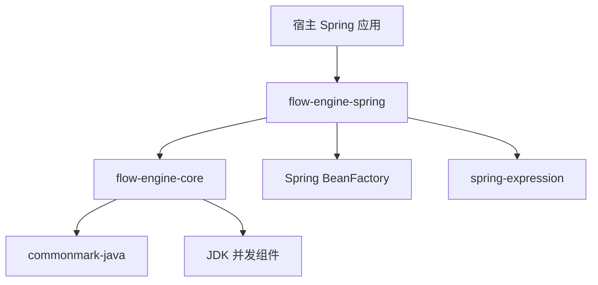
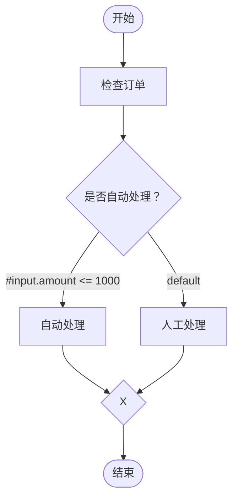
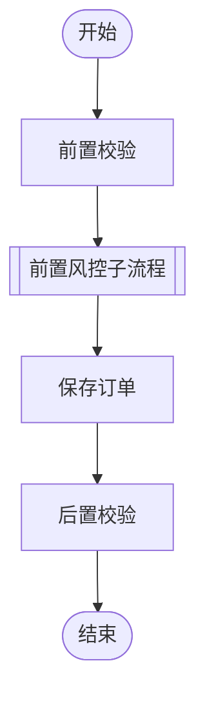
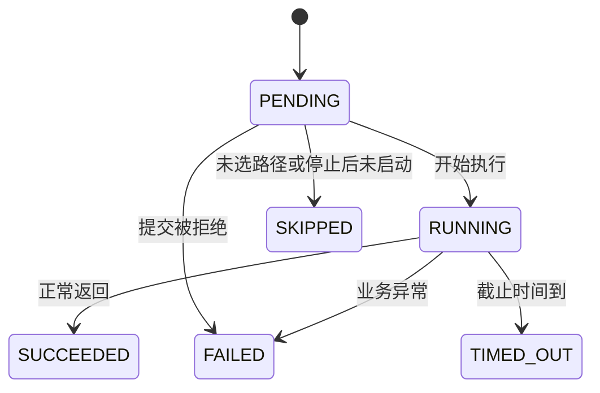

# Flow Engine 技术方案

版本：v0.4 · 评审草案（调用别名与子流程）  
日期：2026-09-05  
依据：Flow Engine 需求文档 v0.4，纯框架定位，包含图形与条件网关约定。  
状态：设计方案，尚未实现或执行性能验证。接口代码用于说明契约，不是完整可编译工程。

## 1. 总体决策

框架接收 Markdown 内容，将其中的 Mermaid flowchart 编译成不可变 DAG，绑定宿主 Spring Bean，再为每次调用创建独立执行实例。串行、并行和排他分支共用运行时；在 DAG 依赖模型上增加边激活状态，使未选路径能够收敛。

| 设计点 | 方案 |
| --- | --- |
| 交付方式 | core、spring、spring-boot-starter 三个框架模块，另附 examples |
| 定义入口 | register(flowId, markdown)，可选资源文件适配 |
| Markdown 解析 | 使用 commonmark-java 提取围栏代码块 |
| Mermaid 解析 | 自建受限词法分析器和语法解析器，只解释需求约定的子集 |
| Bean 接入 | 仅矩形任务绑定 FlowNode；全部网关由引擎处理 |
| 条件路由 | 排他分叉的出边使用受限 SpEL；唯一 true 或显式默认边 |
| 调度方式 | 未决入边计数＋激活计数＋就绪队列，按节点类型推进 |
| 并发一致性 | 每次执行一把 ReentrantLock，锁内只更新状态 |
| 业务执行 | 框架专用、有界线程池；等待依赖不占用工作线程 |
| 数据传递 | 输入只读、祖先结果快照、节点独立输出 |
| 调用方式 | 根 execute 同步；根调用线程协调整棵父子执行树，子流程内部异步完成 |
| 目标解析 | TASK→beanId，CALL_FLOW→flowId；单下划线后为调用别名 |
| 运行结束 | 固定结果快照，单独标识物理退出未确认的任务 |

建议 Java 17 作为首期编译基线，不使用虚拟线程或预览特性。Spring 具体兼容版本及 commonmark-java 的发布版本在建工程时锁定并验证，本文不声称已完成兼容测试。core 不依赖 Spring；这只是内部依赖分层，对外主要使用方式仍是 Spring Bean 编排。

## 2. 模块与依赖



### 2.1 flow-engine-core

按职责划分 Java 包，保持现有 Maven 模块：

| 包（前缀 `io.github.mchgood.flow`） | 职责与主要类型 |
| --- | --- |
| `api` | 流程入口：FlowEngine、FlowDescriptor、ExecutionOptions |
| `node` | 业务节点契约：FlowNode、NodeContext |
| `spi` | 扩展适配契约：NodeResolver、ConditionEvaluator、CompiledCondition、SourceLocation |
| `config` | 引擎资源与期限配置：EngineConfig |
| `result` | 执行结果、节点状态和错误记录 |
| `exception` | 调用与定义错误：FlowException |
| `internal.compiler` | Mermaid 解析、图校验、Bean 绑定；MutableGraph 仅包内可见 |
| `internal.graph` | 不可变编译图 Definition，供编译器和运行时共享 |
| `runtime` | DefaultFlowEngine；调度、注册与每次执行状态 |
| `spring`（Spring 模块） | SpringNodeResolver、SpelConditionEvaluator |

依赖方向：`runtime → internal.compiler → internal.graph`，运行时也读取 `internal.graph`；图模型不依赖编译器或运行时。`api`、`node`、`spi`、`config`、`result`、`exception` 均不依赖实现包或 Spring。`node → result / exception`，`spi → node`，`api → result`。

`DefaultFlowEngine` 是可直接构造的实现入口；其协调器和执行状态仍为私有内部类，不为增加包数量而暴露。`internal.*` 中的 public 仅用于跨包协作，不属于兼容承诺。编译器把可变草稿复制为不可变拓扑、边和祖先集合，再交给运行时；Bean 实例和业务输出不作深拷贝。

本次为尚未发布版本的包名调整，使用方需更新 import；流程语法与执行行为不变。

### 2.2 flow-engine-spring

提供 SpringNodeResolver 和显式 Java 配置入口。宿主定义 FlowEngine Bean，在需要时注册流程并调用。同时提供独立 Spring Boot Starter 自动装配入口；不自动扫描流程目录或启动时强制加载。

仅 TASK 使用业务 Spring Bean；所有网关及起止节点由引擎执行。spring 模块提供 SpelConditionEvaluator，并依赖与宿主 Spring 版本对齐的 spring-expression。core 只依赖 ConditionEvaluator SPI，不直接引用 SpEL 类型。Spring 适配使用容器按名称查找 Bean，并保留返回实例；是否可保留共享实例应结合 Bean 作用域判断。首期约定节点为 singleton，拒绝 prototype 和依赖请求作用域的节点。这是新增的接入限制，需纳入接口文档。[Spring BeanFactory](https://docs.spring.io/spring-framework/docs/current/javadoc-api/org/springframework/beans/factory/BeanFactory.html)、[Bean 作用域](https://docs.spring.io/spring-framework/reference/core/beans/factory-scopes.html)

调用容器返回的代理对象，不解包 AOP target，不自行 new 节点。作用域代理需要检查目标作用域，不能仅看到代理是 singleton 就放行。业务 Bean 的初始化仍由 Spring 负责；register 应在相关 Bean 可用后执行。

## 3. 对外 API 与接入

```java
public interface FlowNode {
    Object execute(NodeContext context) throws Exception;
}

public interface NodeContext {
    String executionId();
    String flowId();
    String nodeId();
    <T> T input(Class<T> type);
    NodeStatus ancestorStatus(String nodeId);
    NodeOutput ancestorOutput(String nodeId);
    <T> T ancestorValue(String nodeId, Class<T> type);
}

// present=true 且 value=null 表示成功但无输出。
public record NodeOutput(boolean present, Object value) {}

public interface FlowEngine extends AutoCloseable {
    FlowDescriptor register(String flowId, String markdown);
    List<FlowDescriptor> registerAll(Map<String, String> markdownByFlowId);
    FlowResult execute(String flowId, Object input, ExecutionOptions options);
    @Override void close();
}

public interface NodeResolver {
    FlowNode resolve(String beanName);
}
```

ancestorOutput 指任意祖先的输出。非祖先访问抛出 ContextAccessException；祖先成功但返回 null，NodeOutput 仍为 present=true。ancestorValue 返回 null 或检查类型后返回值，不做 JSON 序列化转换。类型不匹配作为节点失败处理。上下文包含所有静态祖先的已终结状态，以及成功祖先的输出。未选祖先返回 present=false，可查询 SKIPPED；ancestorValue 对 present=false 抛 MissingNodeOutputException，对成功 null 返回 null。不存在或非祖先仍抛 ContextAccessException。

### 3.1 节点示例

```java
@Component("checkStock")
public class CheckStockNode implements FlowNode {
    private final StockService stockService;

    public CheckStockNode(StockService stockService) {
        this.stockService = stockService;
    }

    @Override
    public Object execute(NodeContext context) {
        OrderRequest request = context.input(OrderRequest.class);
        return stockService.check(request.productId());
    }
}
```

旧 Service 用薄节点包装。Bean 成员仅持有依赖和不可变配置，不保存本次输入、输出或执行 ID。同一个 Bean 可被不同流程以及同一流程内不同节点并发调用。

### 3.2 条件求值接口

```java
public interface ConditionEvaluator {
    CompiledCondition parse(String expression, SourceLocation location);
    boolean evaluate(CompiledCondition condition, ConditionSnapshot snapshot);
}
```

CompiledCondition 为 core 的不透明接口，由 SpEL 适配保存解析结果。ConditionSnapshot 仅含 input 和祖先结果只读视图，不暴露 NodeResolver 或 Spring 容器。TASK 要求 FlowNode；全部网关不得声明 Bean 绑定。

XOR_SPLIT 由引擎内部条件任务求值，不需要用户代码。一次网关求值在有界工作池执行，计算完整条件集合后返回内部 GatewayDecision（selectedEdgeId、targetNodeId、求值记录）；控制锁内只发布结果。这样属性读取或异常不会阻塞协调线程，网关仍可被逻辑超时终结。AND 与 XOR_JOIN 等纯控制操作继续在短锁内推进。

### 3.3 宿主调用

```java
// engine 由宿主创建为 Spring Bean，传入 SpringNodeResolver 和运行配置。
String markdown = loadTextByApplication("flows/createOrder.md");
engine.register("createOrder", markdown);
FlowResult result = engine.execute("createOrder", request,
    ExecutionOptions.withTimeout(Duration.ofSeconds(30)));
```

loadTextByApplication 表示宿主自己的读取逻辑。flowId 使用不含下划线的小驼峰形式。资源适配器可从合规文件名推导 ID；内容入口必须显式传 flowId，不能假定存在文件名。

注册流程需先完成语法、Bean 与流程引用解析，再在注册锁内原子发布不可变注册表快照；同 ID 冲突即报错，不替换已有定义。registerAll 支持一批文档互相引用，全部成功才发布；单文件 register 要求依赖已注册。执行读取固定快照，运行期不重读文件。

## 4. Markdown 与 Mermaid 编译

### 4.1 Markdown 提取

使用 commonmark-java 的 AST 找 FencedCodeBlock，并启用源码位置信息。该库提供 Markdown AST 及源码位置支持，适合将解析错误映射回文档。[commonmark-java](https://github.com/commonmark/commonmark-java)

首期执行块限定为顶层围栏代码块，info 去除两侧空白后必须等于 mermaid；引用块或列表中的 Mermaid 块拒绝并定位，避免缩进后的源码映射歧义。统计全文 Mermaid 块，必须恰好一个。提取时保留原始行号映射，并处理 CRLF、空行和文件头 BOM。普通 Markdown 内容不参与图语义。

definitionHash 使用完整输入 Markdown 的 UTF-8 字节计算 SHA-256；改动说明文字也会改变摘要，这是输入内容标识而非拓扑等价标识。

### 4.2 Mermaid 子集

示例可在支持 Mermaid 的阅读器渲染。节点与目标通过 ID 约定关联，无绑定注释；Mermaid 的基础构成仍为节点和边。[Mermaid flowchart 语法](https://mermaid.ai/open-source/syntax/flowchart.html)



形状映射：矩形为 TASK；起止形为 START/FINISH；菱形标签为 `+` 时是并行网关，其余菱形是排他网关。网关入度=1 且出度>=2 为 SPLIT；入度>=2 且出度=1 为 JOIN；其余度数报错。普通文案不决定业务行为，保留标记 `+` 属于语法。

并行菱形示例：`fork{"+"}` 与 `join{"+"}`。矩形隐式多出/多入仍保持原并行语义；新的流程推荐显式网关。借鉴常见网关符号，不实现完整 BPMN；尤其本方案排他汇合会等待路径状态确定后验证单一激活，区别于一般 token 透传。[网关符号与语义参考](https://camunda.com/en/bpmn/reference/)

简化语法如下。它描述解析器实现，不是新增流程 DSL：

```text
flow      := header NEWLINE statement*
header    := 'flowchart' ('TD' | 'LR')
statement := nodeRef (edge nodeRef)* NEWLINE
           | comment NEWLINE
edge      := '-->' | '-->' '|"' EDGE_LABEL '"|'
nodeRef   := ID | ID '["' LABEL '"]' | ID '[["' LABEL '"]]'
           | ID '{"' LABEL '"}' | virtualNode
ID        := [A-Za-z_][A-Za-z0-9_]*
```

EDGE_LABEL 为单行 SpEL 原文或精确的 default 标记。每条 XOR_SPLIT 出边必须带标签，其他边不允许标签；最多一个 default。SpEL 字符串使用单引号，首期标签内部不支持原始双引号；推荐 and/or 替代 &&/||。lexer 必须识别外层双引号，不能按表达式中的箭头、管道或括号直接 split；非法或未支持的标签转义明确报错。标签去掉 Mermaid 外层引号后，以普通表达式模式解析，不使用模板 #{...}。同源同目标重复边仍拒绝。网关需要显式声明，未声明形状的引用最终才默认 TASK。

virtualNode 仅允许 start/finish 的 `([展示文案])` 写法。默认空白可跳过，语句以换行或 EOF 结束；首期不支持分号、多行标签、HTML 标签、实体转义、标签内双引号。普通标签允许中文和标点，箭头文字即使出现在标签里也不得被误分割。普通注释独占一行；旧绑定指令明确报废弃语法，不参与映射。lexer 优先识别双括号 [[ ]]，不能降级解析为矩形。

使用有状态 lexer 区分标签内部、形状括号、条件标签、普通语法和注释，再用小型递归下降 parser 解析链式边。不能用一个正则表达式或按箭头直接 split 解析整个文件。未知 token、未闭合标签、保留的 Mermaid 关键字冲突均定位报错；不静默忽略尾部文本。

### 4.3 图编译与校验

按以下顺序完成，出现结构问题时不提前实例化业务 Bean：

1. 提取 Mermaid 并校验头部。
2. 解析节点、链式边、形状及完整调用 ID，保留 SourceLocation。
3. 合并同 ID 引用；隐式 ID 由后续显式形状补全，完全没有声明才默认 TASK。两次显式形状/文案冲突报错；根据形状、+ 标记、度数推导 NodeType。
4. 检查重复边、自环、start/finish、网关度数、条件标签完整性、默认边数量、SpEL 语法和允许能力及调用命名。
5. 使用 Kahn 拓扑排序检测环；必要时在残余图做 DFS 输出一条具体环路径。
6. 从 start 正向遍历、从 finish 反向遍历，确认每个业务节点均在有效路径上。
7. 计算入度、前驱、后继和祖先集合；校验并配对结构化排他区域，见 4.4。
8. 仅 resolve TASK 的 Bean，按 FlowNode 校验类型及作用域；拒绝网关绑定。SpEL 解析为只读可复用条件对象，连同源码位置写入 EdgeSpec，构建不可变 FlowDefinition。
9. 检查所有 CALL_FLOW 引用及跨流程环，冻结依赖定义后原子注册。

环检测、可达性校验为 O(V+E)。祖先集合采用 BitSet，按拓扑顺序合并前驱祖先，额外成本约 O(E×V/机器字长)，最坏空间 O(V²/机器字长)，不能把整段编译成本统称为线性。

### 4.4 排他区域的结构约束

首期新增排他区域要求单入口、单出口，避免任意交叉分支引入不明确的汇合行为；原纯串并行 DAG 不要求全部重写成成对网关。

1. 在 DAG 上计算支配与后支配关系。每个 XOR_SPLIT 必须存在唯一最近的共同后支配节点，且该节点是 XOR_JOIN；保存 pairedGatewayId。
2. 对每条出边提取 split 与 join 之间的区域。区域不得有外部入口或通向其他出口；不同分支在 join 前节点集合不得相交。
3. 验证每个 XOR_JOIN 只属于一个匹配 split，不能同时消费来自无关并行区域的输入。
4. 嵌套排他区域先校验再折叠；分支内部并行分叉必须先汇合为单一路径再进入 XOR_JOIN。可用区域内最近共同后支配点验证该收敛性，禁止两条并行活跃边直接进入 XOR_JOIN。
5. 不能唯一配对、提前合流或跨区域连线时报 GATEWAY_STRUCTURE_INVALID，附违规节点/边。

这是额外图分析，不包含在原 O(V+E) 校验成本中。首期节点数上限 512，可用 BitSet 集合迭代实现；实际耗时需单独测量。运行时仍保留活跃输入数量校验，不以静态检查代替异常兜底。

## 5. 编译模型与运行模型

| 对象 | 字段要点 | 生命周期 |
| --- | --- | --- |
| FlowDefinition | flowId、hash、节点列表、邻接表、入度、祖先集合 | 注册后只读共享 |
| NodeSpec | index、nodeId、label、targetId、alias、Bean/子定义引用、NodeType、pairedGatewayId、源码位置 | 定义级 |
| EdgeSpec / EdgeRuntime | edgeId、source、target、conditionText、isDefault、CompiledCondition；UNRESOLVED/ACTIVE/INACTIVE | 定义级 / 每次运行 |
| FlowExecution | executionId、定义引用、input、rootScope引用、ready、stopReason、parentExecutionId、parentNodeId | 每次 execute 独立 |
| NodeRuntime | 状态、unresolvedInputs、activeInputs、inactiveInputs、submitted、selectedEdgeId、时间、结果、错误、TaskHandle | 每次执行的每个节点 |
| ChildExecutionHandle | childExecutionId、父调用节点、完成消费标记 | 一次子流程调用 |
| RootExecutionScope | 共享 lock/condition、活动执行表、截止时间、树容量计数 | 一次根 execute |
| TaskHandle | 任务 Future、是否实际退出、是否取消、资源占用状态 | 一次节点调用 |
| FlowResult | 不可变整体状态、节点记录、错误集合、未退出任务标识 | 返回给调用方 |

NodeType 枚举：START、FINISH、TASK、CALL_FLOW、XOR_SPLIT、XOR_JOIN、AND_SPLIT、AND_JOIN。

index 仅用于数组和 BitSet；对外引用稳定的 nodeId。节点计数和输出数组不得放在 FlowDefinition 或 Bean 中。

FlowResult 不保存可写运行容器，复制元信息及结果映射后返回。业务输出对象仅浅引用，文档明确不可变约定；框架不能防止业务线程修改其自己返回的对象。

## 6. DAG 调度算法

### 6.1 每棵根执行树使用一把短锁

就绪队列、边状态、未决输入计数、节点终态、全局停止标记需要一起变化。首期每棵根执行树使用一把共享短锁，父子状态变化在同一锁下完成；数据容器仍按执行实例隔离。不同根执行树互不争锁。这样子完成与父超时不需要嵌套获取两把执行锁。

锁内禁止业务调用、阻塞等待工作线程、I/O 和用户回调。调度线程在锁外执行提交/取消操作。工作线程也只在开始和结束时短暂进入状态机。

### 6.2 根调用线程作为整棵执行树的调度泵

根 execute 调用线程负责轮转整棵树的活跃父子实例、提交就绪任务、处理子完成、等待共享 condition、检查所有截止时间和生成根结果。子执行实例没有自己的阻塞 execute 调用。工作线程只运行 TASK 或条件任务并发布事件；无需为每个子流程创建协调线程。

condition.awaitNanos 的等待上限为流程截止时间与整棵树所有子流程和运行节点截止时间中的最近值；节点开始、结束、物理退出、关闭请求都会 signal。所有等待必须位于条件循环内，应对虚假唤醒。

算法骨架：

```text
初始化：所有 unresolvedInputs = 入度；边均 UNRESOLVED；start 成功并发布 ACTIVE 出边
循环：
  加锁
    先处理到期项；终态已固定则取结果并退出
    若 stopping：不再取新节点，检查是否收尾结束
    否则：轮转活跃父子实例，消费子完成；推进边解析与正常跳过
          CALL_FLOW 创建子实例；纯控制节点直接推进
          从 ready 取 TASK 或 XOR_SPLIT 内部条件任务，标 submitted，预留在途名额
    若无外部动作：按最近截止时间 condition 等待
  解锁
  执行提交或取消动作；拒绝则进入失败处理
```

同一轮不必把整张图全部提交；受 maxInFlightPerExecution 限制。ready 可按节点 ID 排序便于测试，但不承诺跨流程公平和启动顺序。

### 6.3 节点启动与完成

任务包装器在调用业务之前加锁：检查未停止、未超时、尚为 PENDING 且已提交；通过后转换 RUNNING 并记录开始时刻，解锁后 TASK 调用 Bean，XOR_SPLIT 计算条件集合。该转换是“已启动”的线性化时刻。失败事件已接受后，排队任务即使被线程池取出也不能进入业务。

完成时加锁：先处理到期项，再尝试 RUNNING → SUCCEEDED/FAILED。只有第一次成功终结才发布结果。TASK 成功发布全部 ACTIVE 出边；XOR_SPLIT 按 6.5 完成唯一匹配后，仅选中边 ACTIVE、其余 INACTIVE；求值或匹配错误先置 FAILED，不发布任何成功边。边从 UNRESOLVED 解析为终态时，将目标 unresolvedInputs 减一；到零后按节点类型判定是否就绪、跳过或报错。

多个前驱同时结束会在同一锁内串行处理，因此共同后继只会入队一次。submitted 标记防止从 ready 取出后、工作线程尚未启动的窗口中重复提交。节点执行本身始终在锁外，故业务并行不受这把锁串行化。

### 6.4 边激活与汇合算法

ACTIVE 表示源节点成功且本次选择通过该边；INACTIVE 仅表示正常未选路径，不代表失败。边状态单向转换且只发布一次，重复回调不得二次扣减。

```text
resolve(edge, state):
  要求当前持有 execution.lock
  若 edge 已解析：重复同值忽略，冲突值报内部状态错误
  edge.state = state
  target.unresolvedInputs -= 1
  更新 target.activeInputs 或 inactiveInputs
  若 target.unresolvedInputs == 0：evaluate(target)
```

| 类型 | 输入已全部解析后的处理 |
| --- | --- |
| TASK、CALL_FLOW、XOR_SPLIT、AND_SPLIT、AND_JOIN、FINISH | 全 ACTIVE 则就绪；全 INACTIVE 则正常跳过；混合则 INPUT_PATH_MISMATCH（AND_JOIN 使用 GATEWAY_INPUT_MISMATCH） |
| XOR_JOIN | 一个 ACTIVE 则成功；零 ACTIVE 则正常跳过；多个 ACTIVE 则 GATEWAY_CONFLICT |

XOR_JOIN 必须等待其他入边从 UNRESOLVED 变为 INACTIVE，不是看到首个成功就直接通过。其成功不调用 Bean，向后发布 ACTIVE；正常跳过发布 INACTIVE。未选 TASK/网关转 SKIPPED（BRANCH_NOT_SELECTED），并传播 INACTIVE，整个未选子区域无需运行任何 Bean。

使用迭代 propagationQueue 传播，禁止递归遍历深图。每个执行实例的每条边最多解析一次，因此全树正常遍历成本为各实例 O(V+E) 之和，上下文快照复制成本另计。传播队列有图规模上界；每批限量处理并重新检查超时和 stopping，避免持锁遍历大批虚拟节点影响期限处理。

START、FINISH、AND 网关和 XOR_JOIN 的逻辑开始/结束同一时刻，无 TaskHandle；XOR_SPLIT 求值任务有独立耗时和 TaskHandle。FINISH 成功且全部节点均为 SUCCEEDED 或正常分支 SKIPPED、无错误、无运行任务时整体 SUCCEEDED。仅当整个相关子树均无运行、排队或待完成事件，且 FINISH 未成功时，返回 NO_ACTIVE_PATH；不能无限 condition 等待。

失败引起 stopping 后，不把失败出边发布成 INACTIVE，也不再推进正常网关；执行原失败收尾逻辑。这样业务失败不能被 XOR_JOIN 当作未选路径吞掉。

### 6.5 SpEL 求值与分支选择

注册时调用 SpelExpressionParser 解析并缓存每条边的 Expression；执行时为每次网关创建独立 EvaluationContext，禁止多个流程共享可写上下文。解析缓存生命周期与 FlowDefinition 相同，首期关闭字节码编译模式。

每次网关执行步骤：

1. 获取同一份只读 ConditionSnapshot，含 `#input`、`#results`。所有非默认条件使用该快照。
2. 逐条计算非默认条件；按固定边序保证诊断可复现，但不会遇到第一条 true 就选择。若发生错误立即失败，其余标记 NOT_EVALUATED；不会假装所有表达式均已求值。
3. 使用 `expression.getValue(context)` 获取原始对象并检查 `instanceof Boolean`。禁止 `getValue(context, Boolean.class)` 的隐式转换。null、字符串和数字均失败。
4. 无求值错误时统计 true：一个选中；多个 CONDITION_CONFLICT；零个选 default，没有 default 则 NO_MATCHING_BRANCH。
5. 仅在计算完成且锁内确认未超时、未停止时提交 GatewayDecision，原子发布全部出边状态。

默认边不求值。表达式异常、类型错误或求值超时不能触发默认边。重排条件边不改变成功路由和冲突判断；若多条表达式本身报错，首个诊断错误可随遍历顺序变化，整体始终失败。

#### 求值能力与数据边界

采用 SimpleEvaluationContext，使用只读数据访问且不启用实例方法解析，并关闭赋值；不配置 BeanResolver、用户函数或类型/构造器访问。Spring 明确区分受限 SimpleEvaluationContext 与完整 StandardEvaluationContext，且受限上下文并不保证任意不可信表达式安全。[Spring 求值文档](https://docs.spring.io/spring-framework/reference/core/expressions/evaluation.html)

适配层应按固定 Spring 版本实现 SpEL AST 允许列表，覆盖变量、字面量、只读属性/索引、比较、布尔运算、支持的算术和空值运算；拒绝赋值/自增减、方法/函数、类型、构造器、Bean 引用、正则 matches、集合选择/投影及未知节点。不能仅靠黑名单字符串搜索，也不能只依赖只读 PropertyAccessor 阻止索引写入。SimpleEvaluationContext 的赋值关闭能力须在所选版本验证。[Builder API](https://docs.spring.io/spring-framework/docs/current/javadoc-api/org/springframework/expression/spel/support/SimpleEvaluationContext.Builder.html)

`#results['checkOrder']` 返回不可变的 status/present/value/skipReason 包装。为该视图提供受限访问器：不存在、非祖先键直接抛错；跳过祖先存在但 present=false。字符串字面节点引用尽可能在编译时验证；首期禁用动态拼接结果键，运行时再次做祖先检查。不要将 containsKey 等方法开放给表达式，可直接判断包装的 present。

POJO/record 属性读取仍可能调用 getter/accessor，禁用显式方法调用不等于禁止所有 Java 代码运行。输入和结果应为无副作用的数据对象，不应暴露服务、Class、反射或容器对象；属性访问器拒绝 class 等元属性。框架不自动深拷贝任意业务对象。

建议初始限制：每条表达式最长 2048 字符，每个网关最多 32 条出边；限制 AST 深度与复杂操作，关闭对象自动创建和集合自动扩容。求值使用工作池而非执行锁，适用 defaultGatewayTimeout（建议 1 秒，可覆盖）及流程总期限。超时只保证逻辑终结，不保证阻塞 getter 已物理停止；TaskHandle 的退出跟踪复用原机制。

网关记录各 edgeId 的 TRUE/FALSE/ERROR/NOT_EVALUATED 结果及 selectedEdgeId、targetNodeId。诊断默认不打印实际业务数据。边 ID 由源/目标节点 ID 组合得到（同源同目标重复边已禁止），不可依赖声明位置生成选边身份。

### 6.6 目标名称解析

只有 TASK 与 CALL_FLOW 使用别名规则。先判定形状，再将完整 nodeId 按第一个 `_` 分隔为 targetId 和 alias；不含分隔符则 alias 为空。targetId 语法 `[a-z][A-Za-z0-9]*`，alias 非空时为 `[A-Za-z0-9]+(?:_[A-Za-z0-9]+)*`。数字允许出现在别名首位，连续或尾部下划线拒绝。

TASK 的 targetId 交给 NodeResolver；CALL_FLOW 的 targetId 查 FlowRegistry。网关、start/finish 的 ID 不用于查目标。同一完整 ID 的多处引用仍合并，不同别名是独立 NodeSpec。SpEL 结果键始终为完整 ID，例如 `#results['validateOrder_before'].value.passed`。



### 6.7 子流程定义与执行

**注册引用。** registerAll 先解析所有候选图及 Bean，再以候选集＋现有注册表查找 CALL_FLOW。建立 flowId 依赖图并 DFS 三色标记检测直接/间接环，错误包含完整引用链；缺失目标、重复 flowId 或任何校验失败均不发布。已有定义不可替换，故校验后的子定义引用在运行中稳定。对子流程调用的形状/连线校验与 TASK 一致，不在父图展开子流程节点。

**启动。** CALL_FLOW 就绪时，调度泵检查树容量和深度；成功则 PENDING→RUNNING，创建独立 FlowExecution 和 ChildExecutionHandle，加入 RootExecutionScope 活跃表。输入引用父流程原始只读 input，不复制父节点结果。父调用节点无工作线程、无 TaskHandle；不能通过 submit(() -> execute(...)) 实现。

**推进。** 调度泵公平轮转父子 ready 队列，避免父流程等待子结果时停止提交子任务。父调用节点不占用业务 inFlight 配额；子 TASK/条件任务占用全局线程池配额，并同时计入每个祖先执行实例的 subtreeInFlight 上限，防止通过嵌套绕过父并发限制。调用节点数量由独立树容量约束。

**完成。** 子流程生成固定 FlowResult，在共享锁下产生只消费一次的 CHILD_COMPLETED 事件。父节点尚为 RUNNING 且未超时/终结时：子成功则父 SUCCEEDED 并发布 ACTIVE 出边；子失败则父 FAILED（CHILD_FLOW_FAILED）；子超时则父 TIMED_OUT（CHILD_FLOW_TIMEOUT）。错误链保留 rootExecutionId、各级 executionId、完整调用节点路径与原始错误。迟到事件仅清理资源，不改变父终态。

**结果。** 父 CALL_FLOW 输出为 ChildFlowResultView，固定字段 status（字符串）、executionId、results（子节点结果包装映射），错误详情保留在执行诊断中。成功输出中的嵌套 results 不平铺到父结果表；只通过合法祖先 CALL_FLOW 输出访问，不向父 SpEL 开放全局执行注册表。子流程自身无法读取父节点输出。同一个 flowId 通过不同别名调用时，每次生成新 executionId。

**期限。** childDeadline=min(接纳时刻＋子流程配置期限, parentDeadline)，递归形成所有祖先上限；父 CALL_FLOW 的期限与 childDeadline 相同，不套用普通 Bean 的 defaultNodeTimeout。调用排队及嵌套执行均计入流程时间。达到期限时自上而下处理已过期祖先，避免子成功竞争覆盖父超时。

**停止。** 父流程普通分支失败后，停止该父实例的新节点；已经运行的 CALL_FLOW 子树按原收尾规则继续在有效期限内完成。父总超时、显式强制取消或 close 截止时则整棵后代子树 stopping，跳过未启动工作、请求取消物理任务。根线程中断亦传播到整棵树。已经退出的实例从活跃表移除，尚未物理退出的任务由轻量句柄跟踪；根结果中使用 executionId＋nodeId＋调用路径标识未确认退出的后代任务。

**容量。** maxConcurrentExecutions 只限制外部根调用，子调用不重复获取该许可。建议 maxSubflowDepth=8（根为0），maxExecutionsPerRoot=128（含根、累计创建数），maxActiveChildrenPerRoot=32；达到上限立即使 CALL_FLOW FAILED（SUBFLOW_LIMIT_EXCEEDED），不阻塞等待许可。注册时验证最大静态深度，运行时仍检查容量。所有叶子工作共享有界工作池，线程数为1也能推进完整嵌套流程。

## 7. 线程池、容量与取消

默认创建框架专用 ThreadPoolExecutor，固定工作线程数＋ArrayBlockingQueue＋AbortPolicy。禁止 CallerRunsPolicy，以免调用线程执行业务而无法处理截止时间；禁止静默丢弃策略。JDK 提供有界队列及拒绝处理机制。[ThreadPoolExecutor](https://docs.oracle.com/javase/8/docs/api/java/util/concurrent/ThreadPoolExecutor.html)

建议初始默认值如下，均可配置，需经实际业务压测调整：

| 配置 | 建议初值 | 含义 |
| --- | --- | --- |
| workerThreads | 8 | 全局业务线程数 |
| taskQueueCapacity | 128 | 已提交待执行任务容量 |
| maxConcurrentExecutions | 64 | 已接纳、尚未逻辑终结的根调用数 |
| maxInFlightPerExecution | 8 | 该实例及其后代已提交且尚未物理释放的叶子任务上限 |
| defaultNodeTimeout | 30 秒 | 业务实际启动后的节点期限 |
| defaultGatewayTimeout | 1 秒 | 内部条件任务开始后的网关期限 |
| defaultFlowTimeout | 60 秒 | 接纳后的流程总期限 |
| closeTimeout | 10 秒 | 关闭收尾期限 |
| maxMarkdownBytes / maxNodes / maxEdges | 1 MiB / 512 / 4096 | 编译输入限制 |

流程接纳使用 tryAcquire，不排队等待许可；不足时抛 FlowRejectedException。已接纳后节点提交被线程池拒绝，当前节点记 FAILED（RESOURCE_REJECTED），全流程停止新调度，其余待启动节点 SKIPPED。

超时只终结逻辑状态，不释放仍在运行任务占用的物理容量。任务包装器最外层 finally 才标记 physicalExited 并释放本次在途名额。Future 被取消不等于运行代码已经结束，不能把 Future.isDone 当成物理退出依据。[Future 取消契约](https://docs.oracle.com/javase/8/docs/api/java/util/concurrent/Future.html)

实现时使用 TaskHandle 持有 FutureTask，并由独立外层 Runnable 包装 FutureTask.run，finally 记录物理退出；不依赖 FutureTask.done 判断退出。TaskHandle 在发布到线程池前即写入 NodeRuntime，解决提交后立刻启动、取消句柄尚不存在的竞态。

取消排队任务时：先设置取消状态、调用 cancel，再尝试移除队列中的外层 Runnable。移除成功则标记已释放；移除失败则由包装器 finally 释放。释放操作必须幂等。运行任务 cancel(true) 只请求中断。逻辑终结后释放大结果引用，但物理任务尚在执行时，仍由 TaskHandle 跟踪其退出。

首期以框架专用池作为可靠默认。若提供宿主自有池注入，必须限定异步执行、可观察拒绝、有界队列，且明确框架不关闭外部池；不接受无法验证执行语义的任意 Executor。

## 8. 输入输出与数据可见性

在节点按对应输入规则就绪并准备启动时，按祖先 BitSet 提取终态记录与成功输出，构造不可变上下文快照。结构化条件区域及全输入解析规则保证这些祖先均已终结；出现未决祖先视为内部状态错误。读取接口查这个快照，不能把全局 results Map 暴露给节点。

并行兄弟结果不可见，哪怕它提前完成。想读取另一个节点结果，必须在 Mermaid 中建立依赖路径。这使数据依赖和执行关系一致。

未选祖先返回 NodeOutput(false, null)，成功 null 返回 NodeOutput(true, null)，并通过 ancestorStatus 区分。结果采用 NodeOutput 包装，因此无输出节点仍有存在记录，不使用不允许 null 值的容器工厂直接包装裸业务输出。类型检查发生在节点读取处，失败信息包括请求类型、实际类型、来源节点 ID。

输入和业务输出须不可变或由业务自行复制。框架不传播任意 ThreadLocal，不承诺调用方事务上下文传播。日志关联字段从 NodeContext 获取；若后续加入任务装饰器，必须成对设置并清理线程上下文。

## 9. 状态机、失败与超时



TASK 和 XOR_SPLIT 内部求值使用图示状态机；CALL_FLOW 也使用 PENDING/RUNNING/终态，但由子完成事件驱动，无业务 TaskHandle；纯控制节点在锁内直接 PENDING → SUCCEEDED 或 SKIPPED，输入冲突可 PENDING → FAILED。正常分支跳过不设置 stopping，失败跳过必须有不同 reasonCode。submitted 为内部标记，不新增对外节点状态。未启动节点的开始时间为空。节点超时的结束时间表示逻辑结束时间，物理退出时间单列，不能混用。

### 9.1 普通失败

首次失败在执行锁内设置 stopping 和 firstError，同时将所有未启动节点转 SKIPPED，准备取消排队任务。已 RUNNING 的其他任务可以在各自期限内完成。节点错误存入集合，不能用后来的错误覆盖首错。

没有仍需等待的运行任务后返回 FAILED。若某节点已逻辑超时但物理未退出，保持收尾等待到其退出或流程总期限；流程总期限到达则返回 TIMED_OUT。若超时任务及时退出，流程整体 FAILED，节点状态仍 TIMED_OUT。

### 9.2 截止时间与竞争裁决

持续时间使用 System.nanoTime，墙钟时间只用于展示。记录 flowDeadline 与 nodeDeadline；每次启动、完成、调度唤醒进入锁后先检查过期，避免调用线程暂未醒来时接受超期成功。

采用“状态机接受结果的时刻”作为超时边界：即便业务方法在期限前返回，若发布结果时已经到期，仍判为超时。边界清楚且容易测试，不声称硬实时精度。若流程与节点同时到期，优先处理流程总期限。

流程总超时：固定整体 TIMED_OUT；RUNNING 节点置 TIMED_OUT；未开始节点置 SKIPPED；请求取消所有未退出任务；复制结果并返回。已完成节点保持原有终态。返回中 physicalExitUnconfirmedNodeIds 表达未确认退出的任务。

### 9.3 迟到结果

工作线程必须检查节点终态和 execution.finished。迟到输出不写入结果、不发布边状态或减少后继计数、不覆盖 firstError，只完成物理退出记账。FlowResult 不再随之后的任务退出修改。

### 9.4 调用中断与关闭

这是需求未展开但实现必须固定的边界，建议如下：

- 调用线程被中断：停止该流程、请求取消运行任务，生成 FAILED 快照，错误码 CALLER_INTERRUPTED；返回前恢复线程中断标志。
- 因中断终结但尚未退出的运行节点记 FAILED（EXECUTION_INTERRUPTED），未运行节点 SKIPPED，并保留退出未确认标识。
- close：停止新注册和新接纳；已接纳流程继续至关闭期限。期限后以 ENGINE_CLOSED 失败终结并取消；不新增业务 CANCELLED 状态。
- close 有界返回；对忽略中断的业务线程不保证强制停止。框架池关闭，外部池不关闭。
- 显式 CALL_FLOW 使用内部非阻塞子执行机制；仍禁止 Bean 在本引擎工作线程中同步重入 execute，检测到则抛 ReentrantExecutionException。流程引用图本身也禁止递归环。

运行时异常按节点失败收敛；VirtualMachineError 等 JVM 致命错误不承诺正常恢复。框架不得把此类错误伪装为普通可恢复业务结果。

## 10. 结果和错误契约

| 类型 | 时机 | 对调用方表现 |
| --- | --- | --- |
| FlowDefinitionException | 解析、图校验、绑定、重复注册失败 | 抛异常，含错误列表和源码位置 |
| SUBFLOW_NOT_FOUND / FLOW_REFERENCE_CYCLE | 子流程缺失或流程引用成环 | 注册失败，包含引用路径 |
| CHILD_FLOW_FAILED / CHILD_FLOW_TIMEOUT | 子流程失败或超时 | 父调用节点失败或超时 |
| SUBFLOW_LIMIT_EXCEEDED | 子流程深度或容量超限 | 父调用节点 FAILED |
| FlowNotFoundException | flowId 未注册 | 调用前抛异常 |
| IllegalArgumentException | 配置或调用选项非法 | 调用前抛异常 |
| FlowRejectedException | 并发流程许可不足、引擎已关闭 | 未接纳，抛异常 |
| NODE_FAILED | Bean 业务异常 | FlowResult FAILED |
| CONDITION_CONFLICT | 多个条件为 true | 网关 FAILED，流程 FAILED |
| NO_MATCHING_BRANCH | 全 false 且无默认边 | 网关 FAILED，流程 FAILED |
| EXPRESSION_TYPE_ERROR | 返回值不是 Boolean | 网关 FAILED，流程 FAILED |
| EXPRESSION_EVALUATION_ERROR | 属性访问等运行时求值异常 | 网关 FAILED，流程 FAILED |
| EXPRESSION_SYNTAX_ERROR / EXPRESSION_FORBIDDEN | SpEL 语法或能力限制不满足 | 注册失败，定位条件边 |
| GATEWAY_STRUCTURE_INVALID | 条件区域非法或无法配对 | 注册失败 |
| GATEWAY_CONFLICT / INPUT_PATH_MISMATCH | 活跃输入数量与类型不符 | 流程 FAILED |
| NO_ACTIVE_PATH | 所有工作已收敛但未成功到达 finish | 流程 FAILED |
| RESOURCE_REJECTED | 接纳后提交失败 | FlowResult FAILED |
| NODE_TIMEOUT | 节点期限到 | 节点 TIMED_OUT，流程依收尾情况结束 |
| FLOW_TIMEOUT | 流程期限到 | FlowResult TIMED_OUT |

FlowResult 至少包含 executionId、flowId、definitionHash、status、时间、duration、节点列表（类型、skipReason、selectedEdgeId）、firstError、errors、physicalExitUnconfirmedNodeIds。

DefinitionError 包含 code、message、sourceName、line、column、nodeId、edge；源码位置从 Mermaid token 映射到 Markdown。字符串入口默认 sourceName=flowId。

日志只记录 ID、状态、耗时和错误类别，异常详情由宿主日志配置控制。首期不设计自有日志队列或监控后台；结构化结果已提供主要诊断入口。

## 11. 正确性约束与测试方案

以下不是已经通过的测试，而是实现时的验收门槛。

| 测试组 | 关键用例 | 对应需求 |
| --- | --- | --- |
| 解析 | CRLF、围栏长度、中文标签、标签内箭头、错误位置、非法尾部 | FR-01/02，AC-11/12/13 |
| 图校验 | 重复边、自环、多节点环、孤立节点、错误起止 | FR-04，AC-11 |
| Bean | 默认映射、重复复用、代理调用、作用域拒绝 | FR-03/05，AC-06 |
| 正常调度 | 串行、并行分叉汇合拓扑、非分层 DAG、单线程执行 | FR-07，AC-01～05 |
| 数据 | 祖先访问、兄弟拒绝、null 输出、类型错误、跨实例隔离 | FR-06，AC-07/08/15 |
| 失败 | 失败时排队节点不启动、运行分支收尾、多错误保留 | FR-09，AC-09/16 |
| 超时 | 开始/完成与超时竞争、迟到结果、忽略中断 | FR-10，AC-10 |
| 容量 | 流程许可耗尽、工作队列饱和、取消移除竞态 | FR-08，AC-14 |
| 生命周期 | execute 中断、close 竞争、Bean 同步重入拒绝 | 技术补充边界 |
| 条件网关 | 唯一 true、非法表达式、多默认边、网关错误绑定 | FR-02/03/14/15，AC-17/21/22 |
| 网关汇合 | 排他单路、并行全路、冲突活跃边、布局及标记 | FR-14，AC-18/19/23/24 |
| 未选路径 | 嵌套子区跳过、读取缺失输出、整体成功 | FR-06/14，AC-20/25/27 |
| 结构校验 | 交叉分支、提前合并、配对缺失、并行未先收敛 | FR-04/14，AC-26 |
| SpEL 分支 | 多 true、全 false、默认、类型、异常 | FR-15，AC-28～31 |
| SpEL 边界 | 赋值含索引写入、方法、类型、Bean、非祖先访问 | FR-15，AC-32/33 |
| SpEL 竞争 | 边重排、超时、迟到求值 | FR-15，AC-34/35 |
| 别名 | 默认同名、单下划线、多次调用、非法命名 | FR-03，AC-36/37 |
| 子流程 | 双边框目标、结果嵌套、失败/期限传播、循环引用 | FR-16，AC-38～40/42 |
| 子流程资源 | 单线程嵌套、取消迟到、未选跳过、容量及隔离 | FR-16，AC-41/43～45 |

并发测试使用 CountDownLatch、Barrier 和可控时钟/唤醒器控制关键交错，不主要依赖 sleep。状态机单测验证终态单调、每条边只解析一次、每个节点最多启动一次。另用小规模纯并行 DAG 对照拓扑参考模型；生成成对嵌套 XOR/AND 图，对照独立的顺序控制流解释器验证选中路径、跳过集合和节点调用次数。

性能验证先覆盖空节点、短计算节点和模拟 I/O 节点，分别记录额外调度耗时、P50/P95/P99、吞吐、队列等待、内存、拒绝次数。图规模取 10/100/512 节点，线程数取 1/4/8，验证资源边界及宽图行为。提交报告后再设性能阈值。

## 12. 实施顺序与评审点

| 阶段 | 交付物 | 完成条件 |
| --- | --- | --- |
| 1 | API、语法子集、解析与图编译 | 输入示例及错误定位测试通过 |
| 2 | 串行/并行/排他运行时、边状态和数据快照 | 正常路径、未选路径与单线程测试通过 |
| 3 | 失败、超时、取消与有界资源 | 关键竞争和迟到结果测试通过 |
| 4 | Spring 适配、完整示例、接入文档 | 真实代理 Bean 串并行接入通过 |
| 5 | 基准和代码审查 | 正确性门槛通过，明确容量建议 |

本方案随需求 v0.3 使用 SpEL 出边条件，首期保留条件网关及跳过传播，不引入平台功能。实现前优先确认三项新增细节：节点限定 singleton；根同步调用线程承担整棵父子执行树的协调和截止时间等待；调用中断与强制关闭采用 FAILED 并附原因码。默认容量和期限均为可配置起点，不是业务 SLA。

## 13. v0.4 变更与设计边界

统一 TASK/CALL_FLOW 的小驼峰 targetId 与单下划线 alias，移除注释映射；引入双边框子流程、批量原子注册和引用环校验。根调用线程与共享短锁管理整棵执行树，子完成事件推进父节点，无工作线程同步等待。数据隔离、嵌套结果、期限/取消传播与树容量同步落入契约和测试。

SpEL 唯一匹配、正常跳过传播及原排他区域限制保留。本次没有新增父子数据映射语言或循环执行；子流程默认接收原始 input。方案尚待实现和并发验证，尤其要验证单线程多层嵌套与父超时/子完成的竞争。


## Spring Boot Starter 接入设计

`flow-engine-spring-boot-starter` 同时包含小规模自动配置代码和依赖聚合，避免只有一个自动配置类时再增加独立发布模块。依赖方向为 starter → spring → core，只有 starter 引入 Boot。当前验证基线为 Boot 4.1.1 / Spring 7.0.9。

`boot.autoconfigure.FlowEngineAutoConfiguration` 通过 `META-INF/spring/org.springframework.boot.autoconfigure.AutoConfiguration.imports` 注册，使用 `@ConditionalOnClass` 和 `flow-engine.enabled` 控制生效。四类基础设施分别按类型 `@ConditionalOnMissingBean` 退让，允许覆盖 FlowEngine、NodeResolver、ConditionEvaluator 和 EngineConfig。

`FlowEngineProperties` 用 `@ConfigurationProperties` 绑定 `flow-engine.*`，资源参数默认取自 EngineConfig.defaults()，创建配置时复用 EngineConfig 校验。未知键拒绝绑定，配置只在启动时读取；自定义 EngineConfig 优先于资源属性。配置处理器生成 IDE 元数据。自动创建的 DefaultFlowEngine 通过 Bean destroyMethod=close 管理关闭；流程注册和执行保持显式 API 调用。

验证覆盖：默认启动及业务调用、全部参数绑定、非法和未知参数、禁用开关、各类用户 Bean 覆盖、缺失 core 类、容器关闭、实际自动发现和元数据生成。使用 Spring Boot 官方推荐的 ApplicationContextRunner，另以 EnableAutoConfiguration 验证 imports 入口。完整示例见 [Spring Boot 接入](spring-boot.md)。
