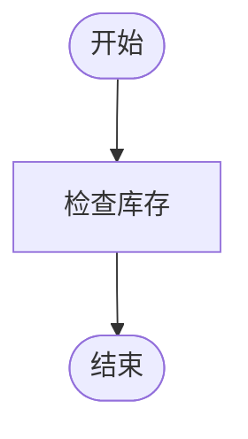
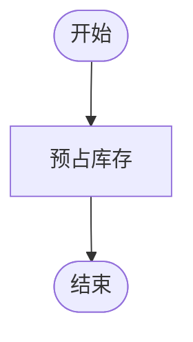
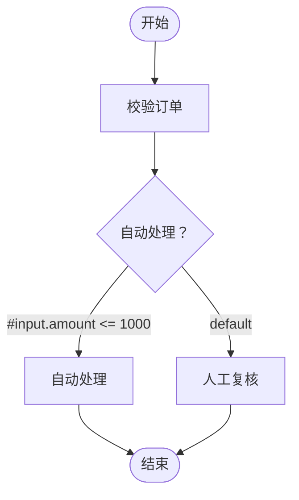
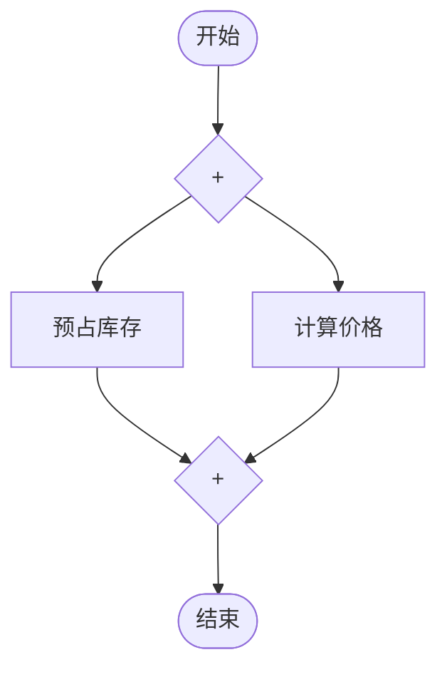
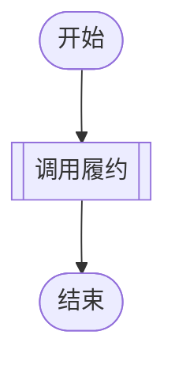
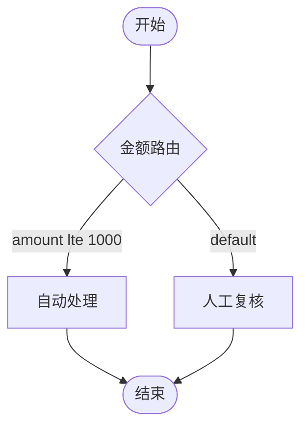

# flow-engine 教程

本教程面向两类读者：想尽快把框架用起来的使用者（第一部分），以及想把自有基础设施接入引擎的扩展开发者（第二部分）。
每章开头用一句话说明本章目标，代码片段均可复制即用。语法与配置项的完整参考不在本文展开，见 [快速使用](quick-start.md) 与 [Spring Boot 接入](spring-boot.md)。

## 第一部分：入门

### 1. 认识 flow-engine

这章你会学到：flow-engine 是什么、能力边界在哪里、由哪些模块组成。

flow-engine 是一个嵌入 Spring 应用的进程内轻量编排引擎：流程结构写在 Markdown 文件的 Mermaid flowchart 里，业务逻辑留在 Spring Bean 里，引擎负责按图调度执行。它不包含数据库、管理控制台、分布式调度或持久化执行——这些能力明确超出项目范围；如果你的场景需要它们，本框架不是合适的选择。

模块地图：

| 模块 | 职责 |
| --- | --- |
| `flow-engine-core` | 公共契约（`api`/`node`/`spi`/`config`/`result`/`exception`）、Mermaid 子集编译、DAG 调度；不依赖 Spring |
| `flow-engine-spring` | 从 Spring 容器解析 `FlowNode` Bean、提供受限只读的 SpEL 条件求值 |
| `flow-engine-spring-boot-starter` | Boot 自动装配、配置绑定、流程文件自动注册（只注册，绝不执行） |
| `flow-engine-examples` | 串行、条件、并行、别名及子流程组合的可运行示例 |
| `flow-engine-coverage` | 仅构建期聚合 JaCoCo 报告，不作为运行期依赖 |

设计取舍与语义细节（例如为什么业务输出不做深拷贝、失败时如何传播）记录在 [需求文档](requirements.md)，架构与实现方案见 [技术方案](technical-design.md)。

### 2. 跑通第一个流程（普通 Spring）

这章你会学到：不使用 Spring Boot 时，如何用三个步骤定义节点、编写流程并注册执行。

环境要求 JDK 17+ 与 Maven 3.9+。当前版本 `0.1.0-SNAPSHOT` 尚未发布 Maven Central，先在框架源码根目录执行：

```bash
mvn install
```

在你的 Spring 应用中引入 Spring 适配模块（传递依赖核心模块）：

```xml
<dependency>
    <groupId>io.github.mchgood</groupId>
    <artifactId>flow-engine-spring</artifactId>
    <version>0.1.0-SNAPSHOT</version>
</dependency>
```

**第一步：定义业务节点。** 每个矩形节点对应一个实现 `FlowNode` 的 singleton Bean，Bean 名称就是节点 ID。下面一个用 lambda 形式，一个用显式方法形式：

```java
package example;

import io.github.mchgood.flow.api.FlowEngine;
import io.github.mchgood.flow.node.FlowNode;
import io.github.mchgood.flow.node.NodeContext;
import io.github.mchgood.flow.runtime.DefaultFlowEngine;
import io.github.mchgood.flow.spring.SpelConditionEvaluator;
import io.github.mchgood.flow.spring.SpringNodeResolver;

import org.springframework.beans.factory.config.ConfigurableListableBeanFactory;
import org.springframework.context.annotation.Bean;
import org.springframework.context.annotation.Configuration;

import java.util.Map;

@Configuration
public class FlowConfiguration {

    // lambda 形式：一行定义一个校验节点
    @Bean
    public FlowNode<Map<String, Object>> validateOrder() {
        return context -> {
            Map<?, ?> input = context.input(Map.class);
            return Map.of("valid", input.containsKey("orderId"));
        };
    }

    // 方法形式：显式实现 execute，适合逻辑较多的节点
    @Bean
    public FlowNode<String> echo() {
        return new FlowNode<>() {
            @Override
            public String execute(NodeContext context) {
                return "echo: " + context.input();
            }
        };
    }

    // 手动装配引擎；容器关闭时自动调用 close()
    @Bean(destroyMethod = "close")
    public FlowEngine flowEngine(ConfigurableListableBeanFactory beans) {
        return new DefaultFlowEngine(new SpringNodeResolver(beans), new SpelConditionEvaluator());
    }
}
```

**第二步：编写流程。** 流程是含且仅含一个顶层 `mermaid` 代码块的 Markdown。Java 里可以用文本块直接内联：

````java
String markdown = """
    ```mermaid
    flowchart TD
        start([开始]) --> validateOrder["校验订单"]
        validateOrder --> echo["回显"]
        echo --> finish([结束])
    ```
    """;
````

**第三步：注册并执行。**

````java
import io.github.mchgood.flow.api.FlowEngine;
import io.github.mchgood.flow.result.FlowResult;

import java.util.Map;

FlowEngine engine = applicationContext.getBean(FlowEngine.class);

engine.register("orderFlow", markdown);

FlowResult result = engine.execute("orderFlow", Map.of("orderId", "A-1"));
if (result.succeeded()) {
    Object valid = result.results().get("validateOrder").value();
    System.out.println("校验结果：" + valid);
    System.out.println(result.results().get("echo").value());
} else {
    result.errors().forEach(error ->
        System.out.println(error.code() + " at " + error.nodeId()));
}
````

三点注意事项：

- `FlowNode` Bean 必须是 singleton 且线程安全：同一个 Bean 可能被多个流程或多个别名节点并发调用，本次调用的输入与状态只能放在 `NodeContext` 与返回值里，不能写进 Bean 成员。
- 同一个 flowId 不允许重复注册（重复注册报 `DUPLICATE_FLOW`）。建议应用启动时用 `registerAll(Map.of(...))` 一次性原子注册全部流程，存在子流程引用关系的流程尤其应该同批注册。
- `register` 与 `execute` 都可能抛出带错误码的 `FlowException`：注册错误属于定义问题，应修复定义而不是捕获后忽略；执行失败通常体现在 `FlowResult` 中。

### 3. Spring Boot 路径

这章你会学到：引入 starter 后如何零配置拿到引擎，以及如何把流程文件放进资源目录自动注册。

Boot 应用引入 starter（传递引入 Spring 适配与核心模块）：

```xml
<dependency>
    <groupId>io.github.mchgood</groupId>
    <artifactId>flow-engine-spring-boot-starter</artifactId>
    <version>0.1.0-SNAPSHOT</version>
</dependency>
```

无需任何手动装配：自动配置会创建 `EngineConfig` 与共享 `FlowEngine`（容器关闭时自动 `close()`），`FlowEngine` 可以直接构造器注入到任意 Bean。流程文件放在 `src/main/resources/flows/` 下，默认扫描 `classpath*:flows/*.md`；一个文件可以用多个一级标题区分多个流程，标题文本就是 flowId（须匹配小驼峰 `[a-z][A-Za-z0-9]*`）：

````markdown
# orderFlow



# fulfillment


````

全部文件汇总会在一个时机（所有单例就绪后）经 `registerAll` 原子注册，子流程引用可以跨文件、跨流程解析；解析或注册失败会阻止应用启动，错误信息包含文件与行号。自动加载只注册、绝不执行流程。

最小 `application.yml`（只显式写出流程加载默认值，其余资源参数全部有默认值，可以什么都不写）：

```yaml
flow-engine:
  flows:
    enabled: true
    locations: classpath*:flows/*.md
```

完整的 `flow-engine.*` 配置项表（线程数、队列、各层期限等）见 [Spring Boot 接入的配置表](spring-boot.md)。当你自己定义了 `FlowEngine`、`NodeResolver`、`ConditionEvaluator`、`EngineConfig` 或 `FlowSource` 类型的 Bean 时，对应的默认 Bean 会自动退让——这正是第二部分扩展实战的基础。

### 4. 核心概念

这章你会学到：五种节点形状的语义、ID 与别名规则，以及条件网关、并行、子流程三种编排结构和结果读取方式。

**节点形状语义。** 只支持 `flowchart TD` 与 `flowchart LR`，且每个流程必须保留 `start([..])` 与 `finish([..])`：

| Mermaid 写法 | 语义 | 是否调用 Bean |
| --- | --- | --- |
| `start([开始])` / `finish([结束])` | 起止节点 | 否 |
| `task["任务"]` | 业务任务，调用 `task` Bean | 是 |
| `task_alias["任务"]` | 业务任务，调用 `task` Bean（`_` 别名） | 是 |
| `decision{"条件？"}` | 排他分支网关（普通菱形） | 否 |
| `merge{"X"}` | 排他汇合网关（X 菱形） | 否 |
| `gateway{"+"}` | 并行分叉或并行汇合（加号菱形） | 否 |
| `child[["子流程"]]` | 调用 flowId 为 `child` 的流程（双边框） | 否 |
| `child_alias[["子流程"]]` | 调用 `child` 流程（带别名） | 否 |

其他形状（圆角、stadium、子图、循环等）不支持，注册期会以错误码失败。

**flowId 与 `_` 别名规则。** 节点 ID 默认等于 Bean ID；当第一个 `_` 之后有非空后缀时，该后缀是别名，实际调用 `_` 前面的 Bean ID。例如 `validateOrder_before` 与 `validateOrder_after` 都调用 `validateOrder` Bean。完整节点 ID（含别名）在本次执行中唯一标识这次调用：状态、结果、超时都按完整 ID 隔离，所以两次调用互不干扰。

**条件网关。** 普通菱形一入多出，每条出边用 `|"条件"|` 写受限 SpEL 表达式，引擎求值后恰好选择一条出边：



求值语义（与 [快速使用](quick-start.md) 一致）：

- 恰好一个条件为 `true`：执行对应分支。
- 多个条件为 `true`：`CONDITION_CONFLICT` 失败。
- 全部为 `false` 且存在 `default` 边：执行 `default` 分支（至多一条）。
- 全部为 `false` 且没有 `default` 边：`NO_MATCHING_BRANCH` 失败。

SpEL 只读两个变量：`#input`（本次流程输入）与 `#results`（可见祖先结果，如 `#results['validateOrder'].present`）；构造器、类型/Bean 访问、方法调用与赋值全部被拒绝，条件必须是严格 `Boolean`，不接受 `"true"` 字符串等真值化转换。

**并行。** `+` 菱形是显式分叉/汇合：分叉激活全部出边分支，汇合等待全部已激活入路径完成：



整个并行区域未激活时（例如它本身在被跳过的分支里），汇合节点整体跳过，不会永远等待。

**子流程。** 双边框矩形调用另一个已注册流程，节点 ID 就是目标 flowId（或 `flowId_别名`）：



`fulfillment[["调用履约"]]` 调用 flowId 为 `fulfillment` 的流程；写作 `fulfillment_main` 时 `main` 是调用别名，同一父流程可以多次调用同一子流程。规则：子流程继承父流程原始输入；子流程拥有独立上下文，不能直接读取父流程内部节点结果；子流程成功后父流程才继续，失败或超时向调用节点传播；引用不允许成环。被引用流程必须在注册调用点已经注册——单独 `register` 要求引用在前，`registerAll` 允许同批互引：

```java
engine.registerAll(Map.of(
    "orderFlow", orderMarkdown,
    "fulfillment", fulfillmentMarkdown
));
```

**结果与错误。** `FlowResult` 是一次执行的终态快照：`status()`（`SUCCEEDED`/`FAILED`/`TIMED_OUT`）、`results()`（完整节点 ID 到 `NodeRecord` 的映射，`NodeRecord.value()` 是业务输出）、`errors()`（`FlowError` 列表，`code()` 是稳定的机器可判断错误码，不要解析 `message()`）。节点级状态见 `NodeStatus`：`PENDING`、`RUNNING`、`SUCCEEDED`、`FAILED`、`TIMED_OUT`、`SKIPPED`。默认失败语义：业务异常停止新工作，已在运行的任务允许有界完成；节点超时导致 `FAILED`，流程期限耗尽则是流程级 `TIMED_OUT`。

### 5. 常见问题

这章你会学到：三层期限如何生效、SKIPPED 与 FAILED 如何区分，以及为什么业务 Bean 不能保存调用状态。

**三层期限。** 期限在引擎创建时固定，默认值来自 `EngineConfig.defaults()`：

| 期限 | 默认值 | 作用范围 |
| --- | --- | --- |
| node-timeout | 30 秒 | 单个业务任务，从任务实际开始计时 |
| gateway-timeout | 1 秒 | 条件网关求值，从求值开始计时 |
| flow-timeout | 60 秒 | 根流程默认期限，也是每次子流程调用的期限上限 |

单次根流程执行可以用 `ExecutionOptions` 覆盖流程期限（不影响节点/网关期限，也不改变引擎配置）：

```java
FlowResult result = engine.execute("orderFlow", input,
    ExecutionOptions.withTimeout(Duration.ofSeconds(10)));
```

期限是逻辑终态：Java 无法强制终止线程，对忽略中断的业务代码，引擎会先发布超时结果，`FlowResult.physicalExitUnconfirmed()` 会列出尚未确认物理退出的任务路径。

**SKIPPED 还是 FAILED？** 看节点记录的两个字段：`FAILED` 表示任务真的执行过且失败，`NodeRecord.error()` 携带错误；`SKIPPED` 表示任务根本没执行——要么在条件网关未选中的分支上，要么因为上游失败/流程停止而不再调度，`NodeRecord.skipReason()` 说明原因。`TIMED_OUT` 则表示逻辑期限耗尽，底层代码可能仍在退出中。

**为什么业务 Bean 不能存调用状态？** 引擎把 singleton Bean 当作无状态服务复用：同一 Bean 会被多个流程、多个别名节点并发调用，如果本次调用的中间结果写进 Bean 成员，并发调用会互相覆盖。请把每次调用的数据放在局部变量、`NodeContext` 读取的输入/祖先结果以及返回值里；需要跨节点传递的数据用祖先结果读取（`context.ancestorValue("validateOrder", Map.class)`）或在 SpEL 里访问 `#results`。另外，业务代码不得同步重入当前引擎（例如在节点里直接调 `engine.execute`），需要调用子流程请用双边框节点，引擎会用完成事件做逻辑等待，不阻塞工作线程。

## 第二部分：扩展实战

### 6. 扩展点全景

这章你会学到：框架暴露的四个扩展点分别何时触发、用什么方式覆盖默认实现。

| 扩展点 | 触发时机 | 典型场景 | 覆盖方式 |
| --- | --- | --- | --- |
| `NodeResolver` | 注册期：按 Bean ID 把矩形节点绑定为可调用节点 | 非 Spring 容器、多容器、静态注册表 | 定义 `NodeResolver` Bean（普通 Spring 直接传入构造器） |
| `ConditionEvaluator` | 注册期 `parse`，运行期 `evaluate` | 接入规则引擎、决策服务 | 定义 `ConditionEvaluator` Bean |
| `FlowSource` | 启动期：提供流程 Markdown 文档 | Nacos、数据库、远程配置中心 | 定义 `FlowSource` Bean（定义后本地文件来源退让，多个来源可共存） |
| `EngineConfig` | 引擎创建期：固定资源与期限参数 | 程序化配置资源 | 定义 `EngineConfig` Bean |

约定：

- 在 Spring Boot 中，宿主定义同类型 Bean 即可，默认实现通过 `@ConditionalOnMissingBean` 自动退让；每种类型通常只定义一个，存在多个候选时需要 `@Primary` 明确选择。
- 在普通 Spring 中没有"退让"的概念，直接把你的实现传入 `new DefaultFlowEngine(resolver, evaluator, config)`。
- 替换 `ConditionEvaluator` 时，只读、严格 Boolean 等语义约束由你自行维持（见第 8 章硬约束）。

### 7. 实战 1：自定义 NodeResolver

这章你会学到：如何脱离 Spring 容器按 Bean ID 提供任务节点，以及如何测试缺失节点的失败路径。

`NodeResolver` 是函数式接口，只在注册期被调用（不处理网关与子流程调用），解析结果存入编译图跨执行复用。最常见的需求是用静态注册表替代容器查找：

```java
package example;

import io.github.mchgood.flow.node.FlowNode;
import io.github.mchgood.flow.spi.NodeResolver;

import java.util.Map;

/**
 * 基于静态注册表的节点解析器；不可变，天然线程安全。
 */
public final class StaticNodeResolver implements NodeResolver {

    private final Map<String, FlowNode<?>> nodes;

    public StaticNodeResolver(Map<String, FlowNode<?>> nodes) {
        this.nodes = Map.copyOf(nodes);
    }

    @Override
    public FlowNode<?> resolve(String beanId) {
        return nodes.get(beanId);
    }
}
```

使用方式（普通 Spring 下替换第 2 章的默认解析器）：

```java
package example;

import io.github.mchgood.flow.api.FlowEngine;
import io.github.mchgood.flow.node.FlowNode;
import io.github.mchgood.flow.runtime.DefaultFlowEngine;
import io.github.mchgood.flow.spi.NodeResolver;
import io.github.mchgood.flow.spring.SpelConditionEvaluator;

import java.util.Map;

FlowNode<Map<String, Object>> validateOrder = context -> Map.of("valid", true);
FlowNode<Void> audit = context -> null;

NodeResolver resolver = new StaticNodeResolver(Map.of(
    "validateOrder", validateOrder,
    "audit", audit
));

FlowEngine engine = new DefaultFlowEngine(resolver, new SpelConditionEvaluator());
```

因为接口只有 `resolve` 一个方法，也可以直接写 lambda：`NodeResolver resolver = registry::get;`。

行为约定：`resolve` 返回 `null` 时，引擎在注册期报 `BEAN_NOT_FOUND`——错误在图编译阶段暴露，不会拖到运行期。返回的 `FlowNode` 会被并发调用，必须线程安全。测试要点是断言缺失 Bean 的注册失败与错误码：

````java
package example;

import io.github.mchgood.flow.exception.FlowException;
import io.github.mchgood.flow.runtime.DefaultFlowEngine;
import io.github.mchgood.flow.spring.SpelConditionEvaluator;

import org.junit.jupiter.api.Test;

import java.util.Map;

import static org.junit.jupiter.api.Assertions.assertEquals;
import static org.junit.jupiter.api.Assertions.assertThrows;

@Test
void missingBeanFailsRegistration() {
    var engine = new DefaultFlowEngine(
        new StaticNodeResolver(Map.of()), new SpelConditionEvaluator());
    String markdown = """
        ```mermaid
        flowchart TD
            start([开始]) --> ghost["幽灵节点"]
            ghost --> finish([结束])
        ```
        """;
    var failure = assertThrows(FlowException.class,
        () -> engine.register("orderFlow", markdown));
    assertEquals("BEAN_NOT_FOUND", failure.code());
}
````

### 8. 实战 2：自定义 ConditionEvaluator

这章你会学到：条件扩展点两个方法的分工，以及实现必须遵守的三条硬约束。

`ConditionEvaluator` 有两个方法（注意不是函数式接口，不能写成单个 lambda）：`parse` 在注册期把条件文本编译为可复用对象，`evaluate` 在运行期工作线程上求值。下面用一个最小规则表达式（形如 `amount lte 1000`）演示推荐的实现形态——`parse` 结果缓存在不可变 record 里，`evaluate` 只做纯计算：

```java
package example;

import io.github.mchgood.flow.exception.FlowException;
import io.github.mchgood.flow.node.NodeContext;
import io.github.mchgood.flow.spi.CompiledCondition;
import io.github.mchgood.flow.spi.ConditionEvaluator;
import io.github.mchgood.flow.spi.SourceLocation;

import java.util.Map;
import java.util.Set;

/**
 * 最小规则语言的条件求值器：表达式为 "字段 操作符 阈值"，如 amount lte 1000。
 * 无状态且只操作不可变对象，可被并发注册与并发求值。
 */
public final class RuleConditionEvaluator implements ConditionEvaluator {

    // 编译结果缓存在不可变 record 中，evaluate 不再解析文本
    private record RuleCondition(String field, String operator, long threshold)
            implements CompiledCondition {
    }

    private static final Set<String> OPERATORS = Set.of("lt", "lte", "gt", "gte");

    @Override
    public CompiledCondition parse(String expression, SourceLocation location) {
        String[] parts = expression.trim().split("\\s+");
        if (parts.length != 3 || !OPERATORS.contains(parts[1])) {
            throw new FlowException("EXPRESSION_SYNTAX_ERROR", location + " " + expression);
        }
        try {
            return new RuleCondition(parts[0], parts[1], Long.parseLong(parts[2]));
        } catch (NumberFormatException exception) {
            throw new FlowException("EXPRESSION_SYNTAX_ERROR", location + " " + expression, exception);
        }
    }

    @Override
    public boolean evaluate(CompiledCondition condition, NodeContext context) {
        var rule = (RuleCondition) condition;
        Object raw = ((Map<?, ?>) context.input()).get(rule.field());
        if (!(raw instanceof Number number)) {
            // 严格 Boolean 语义：字段缺失或非数字必须失败，不能真值化、也不能静默当作 false
            throw new FlowException("EXPRESSION_TYPE_ERROR",
                rule.field() + " 期望数字，实际为 " + raw);
        }
        long value = number.longValue();
        return switch (rule.operator()) {
            case "lt" -> value < rule.threshold();
            case "lte" -> value <= rule.threshold();
            case "gt" -> value > rule.threshold();
            default -> value >= rule.threshold();
        };
    }
}
```

在流程里的用法与内置 SpEL 完全相同，只是条件文本换成你的 DSL：



三条硬约束（默认 `SpelConditionEvaluator` 就是这样实现的，自定义时必须同样遵守）：

1. **只读**：不得修改输入对象与祖先结果，不提供任何写入路径；`NodeContext` 只暴露当前输入与静态祖先，实现也不应尝试绕过它访问其他节点。
2. **严格 Boolean**：求值结果要么是确定的布尔值，要么抛异常。禁止把非空字符串、非零数字、非 null 对象隐式当作 `true`。
3. **无副作用且有界延迟**：求值发生在工作线程上，必须在 gateway-timeout（默认 1 秒）内返回；把规则加载、远程查询等昂贵操作放在 `parse` 阶段或外部缓存完成，`evaluate` 保持纯计算。实现必须线程安全（并发 `parse` 与并发 `evaluate`）。

测试要点：非布尔可求值的表达式必须失败。`NodeContext` 有公开构造器，可以直接单测：

```java
package example;

import io.github.mchgood.flow.exception.FlowException;
import io.github.mchgood.flow.node.NodeContext;
import io.github.mchgood.flow.spi.SourceLocation;

import org.junit.jupiter.api.Test;

import java.util.Map;

import static org.junit.jupiter.api.Assertions.assertEquals;
import static org.junit.jupiter.api.Assertions.assertThrows;

@Test
void nonBooleanEvaluationFails() {
    var evaluator = new RuleConditionEvaluator();
    var location = new SourceLocation("orderFlow", 3, 15);
    var condition = evaluator.parse("amount lte 1000", location);

    var context = new NodeContext(
        "exec-1", "orderFlow", "decision", Map.of("amount", "not-a-number"), Map.of());

    var failure = assertThrows(FlowException.class,
        () -> evaluator.evaluate(condition, context));
    assertEquals("EXPRESSION_TYPE_ERROR", failure.code());
}
```

### 9. 实战 3：自定义 FlowSource（Nacos 式）

这章你会学到：如何把远程配置中心的流程文档接入启动期自动注册，以及自动加载管线的行为约定。

`FlowSource` 实现提供一批 Markdown 文档（`FlowDocument(sourceName, markdown)`），加载器统一负责按一级标题切分与注册。下面以 Nacos 为例；为避免引入具体 SDK 依赖，客户端用注释示意，接入时替换为你环境的真实客户端：

```java
package example;

import io.github.mchgood.flow.spi.FlowDocument;
import io.github.mchgood.flow.spi.FlowSource;

import java.util.List;

/**
 * 从 Nacos 配置中心拉取流程文档的来源实现。
 * 无请求状态，线程安全；每次 load() 返回当时的完整文档集。
 */
public final class NacosFlowSource implements FlowSource {

    // 宿主环境中的真实客户端最小接口示意（不引入真实 SDK 依赖，接入时替换）：
    // public interface NacosClient {
    //     List<String> listDataIds(String group);
    //     String getConfig(String dataId, String group);
    // }

    private final NacosClient client;
    private final String group;

    public NacosFlowSource(NacosClient client, String group) {
        this.client = client;
        this.group = group;
    }

    @Override
    public String name() {
        return "nacos";
    }

    @Override
    public List<FlowDocument> load() {
        return client.listDataIds(group).stream()
                .map(dataId -> new FlowDocument("nacos:" + dataId, client.getConfig(dataId, group)))
                .toList();
    }
}
```

注册为 Bean 即被自动消费（Boot 自动装配的注册器会在所有单例就绪后调用它）：

```java
// 放入任意 @Configuration 类；import io.github.mchgood.flow.spi.FlowSource
// 与 org.springframework.context.annotation.Bean
@Bean
public FlowSource nacosFlowSource() {
    return new NacosFlowSource(realNacosClient(), "flow-flows");
}
```

行为约定：

- 定义任意 `FlowSource` Bean 后，starter 内置的本地文件来源自动退让；多个 `FlowSource` 可以共存，按 Spring 次序依次加载，同一批次原子注册，跨来源、跨文件的子流程引用都能解析。
- 不同来源出现相同 flowId 时启动失败，错误为 `DUPLICATE_FLOW` 并同时给出两个来源名，便于定位冲突。
- `load()` 读取失败时抛出非受检异常（把 SDK 受检异常包装成 `IllegalStateException` 等），会导致自动加载启动失败——引擎不会带着不完整的流程集继续运行。
- 文档格式与本地文件完全一致：一级标题即 flowId（须匹配 `[a-z][A-Za-z0-9]*`），每个标题下恰好一个 `mermaid` 代码块。MD 超过 1 MiB（UTF-8 字节）、flowId 非法、重复标题、缺 mermaid 块等限制由引擎与加载管线统一校验（错误码如 `DEFINITION_LIMIT`、`INVALID_FLOW_HEADING`、`MERMAID_BLOCK_COUNT`），`FlowSource` 实现无需重复校验。
- `flow-engine.flows.enabled=false` 会同时关闭本地文件扫描与自定义 `FlowSource` 的消费；`FlowSource` 中的内容同样不会被自动执行，执行时机始终由宿主控制。

### 10. EngineConfig 程序化覆盖

这章你会学到：如何用代码精确设定线程、队列、并发额度与各层期限，以及它与配置文件的关系。

`EngineConfig` 是不可变 record，在引擎创建时固定，运行期不可修改。Boot 用户定义一个 `EngineConfig` Bean 即可覆盖基于配置文件的默认工厂：

```java
package example;

import io.github.mchgood.flow.config.EngineConfig;

import org.springframework.context.annotation.Bean;
import org.springframework.context.annotation.Configuration;

import java.time.Duration;

@Configuration
public class EngineTuningConfiguration {

    @Bean
    public EngineConfig flowEngineConfig() {
        return new EngineConfig(
            8,                       // workerThreads：共享工作线程数，至少 1；默认 8
            128,                     // queueCapacity：共享工作队列容量，至少 1；默认 128
            64,                      // maxConcurrentExecutions：同时接纳的根调用数，至少 1；默认 64
            8,                       // maxInFlightPerExecution：单执行树在途任务额度，至少 1；默认 8
            8,                       // maxSubflowDepth：子流程最大嵌套深度，0 到 32；默认 8
            128,                     // maxExecutionsPerRoot：根流程累计执行实例上限，至少 1；默认 128
            32,                      // maxActiveChildren：活跃子执行数量上限，至少 1；默认 32
            Duration.ofSeconds(30),  // nodeTimeout：节点期限（任务实际开始后计时）；默认 30 秒
            Duration.ofSeconds(1),   // gatewayTimeout：条件网关求值期限；默认 1 秒
            Duration.ofSeconds(60),  // flowTimeout：流程默认期限，也是子流程期限上限；默认 60 秒
            Duration.ofSeconds(10)   // closeTimeout：关闭时等待根调用完成的期限；默认 10 秒
        );
    }
}
```

说明：

- 一旦存在这个 Bean，`application.yml` 中的 `flow-engine.worker-threads` 等资源参数不会再覆写它——配置文件值与程序化 Bean 之间，Bean 优先。`flows.*` 等加载行为配置不受影响。
- 参数范围非法（如 `workerThreads` 为 0、`maxSubflowDepth` 超过 32、期限为 0 或超过 1 天）会在构造时抛出 `IllegalArgumentException`，在 Boot 下表现为启动失败。
- 普通 Spring 项目不经过 starter，直接把配置传给引擎：`new DefaultFlowEngine(resolver, evaluator, config)`。
- 不需要全量手写 11 个参数时，可以基于 `EngineConfig.defaults()` 的值理解语义后按需调整；本表中的默认值即 `EngineConfig.defaults()` 的实际取值。

### 11. 扩展点测试要点

这章你会学到：为扩展点编写测试时应断言什么，以及并发与注册期校验失败路径怎么测。

- **错误码断言**：所有引擎错误都通过 `FlowException.code()` 或 `FlowResult.errors()` 中的 `FlowError.code()` 暴露稳定错误码，断言错误码而不是解析 message。注册期错误直接捕获 `FlowException`；运行期错误检查结果对象，必要时同时断言 `FlowError.nodeId()` 与 `callPath()` 这类定位信息。
- **线程安全**：解析器会在注册期被并发调用（并发 `registerAll` 时），求值器会在工作线程上并发 `evaluate`。并发测试要使用同步屏障与有界等待，并在 `finally` 中清理线程池：

```java
package example;

import io.github.mchgood.flow.node.NodeContext;
import io.github.mchgood.flow.spi.SourceLocation;

import org.junit.jupiter.api.Test;

import java.util.ArrayList;
import java.util.Map;
import java.util.concurrent.CountDownLatch;
import java.util.concurrent.ExecutorService;
import java.util.concurrent.Executors;
import java.util.concurrent.Future;
import java.util.concurrent.TimeUnit;

import static org.junit.jupiter.api.Assertions.assertTrue;

@Test
void evaluatorSupportsConcurrentEvaluate() throws Exception {
    var evaluator = new RuleConditionEvaluator();
    var condition = evaluator.parse("amount gte 100", new SourceLocation("orderFlow", 3, 15));
    var context = new NodeContext(
        "exec-1", "orderFlow", "decision", Map.of("amount", 500), Map.of());

    int threads = 8;
    var startLatch = new CountDownLatch(1);
    ExecutorService pool = Executors.newFixedThreadPool(threads);
    try {
        var futures = new ArrayList<Future<Boolean>>();
        for (int i = 0; i < threads; i++) {
            futures.add(pool.submit(() -> {
                startLatch.await();
                return evaluator.evaluate(condition, context);
            }));
        }
        startLatch.countDown();
        for (Future<Boolean> future : futures) {
            assertTrue(future.get(5, TimeUnit.SECONDS));
        }
    } finally {
        pool.shutdownNow();
    }
}
```

- **注册期校验失败路径**：对畸形输入断言确定性的错误码，例如非法标题 `INVALID_FLOW_HEADING`、段落缺 mermaid 块 `MERMAID_BLOCK_COUNT`、文档超限 `DEFINITION_LIMIT`、节点缺失 `BEAN_NOT_FOUND`、流程 ID 重复 `DUPLICATE_FLOW`、未知子流程 `SUBFLOW_NOT_FOUND`、引用成环 `FLOW_REFERENCE_CYCLE`。负例测试同时断言副作用（例如注册失败后同名流程仍可重新注册成功，引擎状态未被污染）。
- **场景完整性**：已验证场景清单与尚未覆盖的风险见 [测试覆盖审查](testing-coverage.md)；为扩展点新增测试时，先核对其中对应分类，避免重复建设或遗漏竞态场景。

## 附录：文档地图

各文档的分工如下，按需阅读，本文不重复其内容：

| 文档 | 内容 | 什么时候读 |
| --- | --- | --- |
| [README](../README.md) | 项目定位、能力概览、模块与包结构 | 第一次接触项目时 |
| [需求文档](requirements.md) | 语义需求与关键决策（错误传播、只读约束等） | 对"为什么这样设计"有疑问时 |
| [技术方案](technical-design.md) | 架构、编译与调度实现设计 | 修改框架源码或排查引擎行为时 |
| [快速使用](quick-start.md) | 完整语法参考、非 Boot 手动装配、图形语法速查表 | 编写或调试流程定义时 |
| [Spring Boot 接入](spring-boot.md) | starter 依赖、完整配置表、覆盖规则 | Boot 接入与参数调优时 |
| [测试覆盖审查](testing-coverage.md) | 已验证场景、断言范围与剩余风险 | 编写测试或评估变更影响时 |
| 本教程 | 分层学习路径：入门五步到扩展实战 | 首次上手与规划扩展点接入时 |
