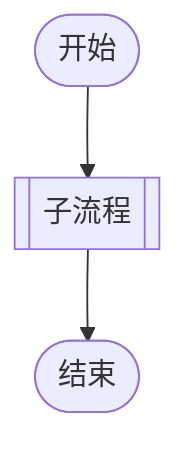
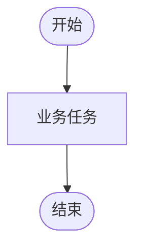

# parent

```mermaid
flowchart TD
    start([开始]) --> child_main[["子流程"]]
    child_main --> finish([结束])
```

# child

```mermaid
flowchart TD
    start([开始]) --> work_inner["业务任务"]
    work_inner --> finish([结束])
```
